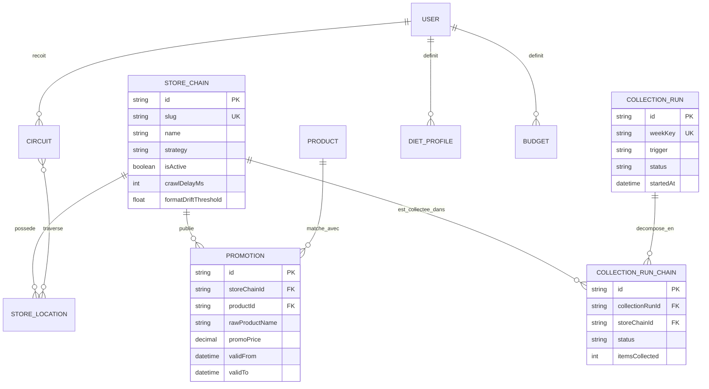
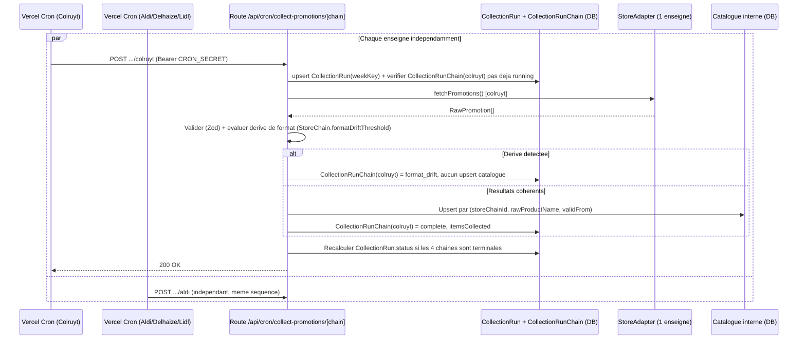

# Architecture — PromoScan (F1 — Collecte & structuration des promotions)

> Agent : Software Architect (#2) — Phase 2 (Fondation) du pipeline Hub & Spoke
> Date : 2026-08-08
> Source : `docs/FOUNDATION.md` (§3, §5, §6, §7, §9.1, §10.1), `docs/brainstorm/L3-f1-collecte-promotions.md`, `docs/USER-STORIES.md`, `docs/JOURNAL.md` (entrée Product Owner — SESSION 3)
> Périmètre : **F1 uniquement**. F2/F3/F4 laissées en squelette de schéma, non conçues.

---

## 0. Résumé — les deux décisions tranchées

| # | Question ouverte (PO) | Décision retenue | Détail |
|---|------------------------|-------------------|--------|
| 1 | Seuil numérique de "dérive de format" (US-F1-07) | **Seuil relatif configurable par enseigne, défaut -50 % vs dernier run réussi**, stocké sur `StoreChain.formatDriftThreshold` | §4 |
| 2 | Stratégie cron (US-F1-01, L3 §4) | **Un cron Vercel distinct par enseigne (4 crons)**, joints sous un même `CollectionRun` hebdomadaire via `weekKey`, résultats par enseigne dans une table normalisée `CollectionRunChain` | §5 |

Les deux sections dédiées ci-dessous appliquent le protocole `/selfdoubt` (3+ composants impactés).

---

## 1. Stack technique — confirmation FOUNDATION §5

| Couche | Techno | Statut | Justification / ajustement |
|--------|--------|--------|------------------------------|
| Framework full-stack | Next.js 14+ (App Router) | ✅ Confirmé | Un seul projet, Route Handlers = API, déploiement natif Vercel |
| Hébergement | Vercel | ⚠️ Ajusté | FOUNDATION suppose le tier gratuit (Hobby). La décision cron (§5) nécessite de **vérifier le tier réel du compte** (nombre de cron jobs et `maxDuration` disponibles diffèrent entre Hobby et Pro) — signalé à DevOps (#8) |
| Orchestration planifiée | Vercel Cron Jobs | ✅ Confirmé, précisé | 4 crons distincts au lieu d'un orchestrateur unique (§5) |
| Rendu JS scraping (Delhaize, Lidl) | Playwright + `@sparticuz/chromium` | ✅ Confirmé | Inchangé |
| Base de données | Supabase Postgres (Prisma) | ✅ Confirmé | Inchangé |
| Authentification | Supabase Auth (cookies httpOnly via `@supabase/ssr`) | ✅ Confirmé | Session vérifiée côté serveur dans chaque route protégée |
| Validation | Zod | ✅ Confirmé | Frontière domaine, réutilisée entre `RawPromotion` et payloads API |
| Extraction IA fallback | Claude API (Vision) | ✅ Confirmé | P1 (US-F1-05), non structurant pour l'architecture F1 |
| Frontend UI | React + TS strict + Tailwind + Zustand + TanStack Query + RHF + Zod | ✅ Confirmé | Inchangé |

**Point d'attention nouveau (issu de la décision §5) :** le passage à 4 crons distincts peut nécessiter le tier **Vercel Pro** si le compte est actuellement en Hobby (limite historique du nombre de cron jobs par projet sur Hobby, et `maxDuration` plus restreint). Confiance modérée sur les chiffres exacts actuels (évoluent régulièrement côté Vercel) — **à vérifier explicitement par DevOps (#8) avant la Phase 5**, avec un plan de repli documenté en §5.4 si le compte reste Hobby.

---

## 2. Schéma de données définitif

### 2.1 Tables F1 (détaillées)

| Table | Rôle | Changement vs FOUNDATION §3 / L3 §2 |
|-------|------|----------------------------------------|
| `StoreChain` | Une enseigne (Colruyt/Aldi/Delhaize/Lidl) | + `crawlDelayMs`, + `formatDriftThreshold` (décision #1) |
| `Product` | Référentiel produit canonique (matching différé, hors F1) | Inchangé |
| `Promotion` | Une promotion collectée | Inchangé (types précisés en Prisma) |
| `CollectionRun` | Un cycle de collecte (hebdomadaire ou manuel) | + `weekKey` (nullable), + `trigger` (`cron`\|`manual`) — nécessaire pour joindre les 4 crons indépendants sous un même run (décision #2) |
| `CollectionRunChain` **(nouvelle table)** | Résultat de collecte d'**une** enseigne pour un `CollectionRun` donné | Remplace le champ JSON `resultsByChain` de FOUNDATION/L3 — voir justification §5.2 |

### 2.2 Schéma Prisma (spécification définitive pour Backend #4)

```prisma
enum StoreStrategy {
  api
  html
  headless
}

enum CollectionRunStatus {
  running
  partial
  complete
  failed
}

enum ChainRunStatus {
  pending
  running
  complete
  failed
  format_drift
}

enum RunTrigger {
  cron
  manual
}

model StoreChain {
  id                   String        @id @default(cuid())
  slug                 String        @unique // "colruyt" | "aldi" | "delhaize" | "lidl"
  name                 String
  strategy             StoreStrategy
  baseUrl              String
  isActive             Boolean       @default(true)
  crawlDelayMs         Int           @default(2000) // 5000 chez Colruyt (RG explicite), 2000 par defaut sinon
  formatDriftThreshold Float         @default(0.5)  // seuil relatif de baisse (0.5 = -50%), configurable par enseigne
  promotions           Promotion[]
  runChains            CollectionRunChain[]

  @@map("store_chains")
}

model Product {
  id            String      @id @default(cuid())
  canonicalName String
  category      String?
  aliases       String[]
  promotions    Promotion[]

  @@map("products")
}

model Promotion {
  id              String     @id @default(cuid())
  storeChainId    String
  storeChain      StoreChain @relation(fields: [storeChainId], references: [id])
  productId       String?
  product         Product?   @relation(fields: [productId], references: [id])
  rawProductName  String
  category        String?
  unitLabel       String?
  regularPrice    Decimal?   @db.Decimal(10, 2)
  promoPrice      Decimal    @db.Decimal(10, 2)
  discountPercent Float?
  pricePerUnit    Decimal?   @db.Decimal(10, 2)
  originLabel     String?
  validFrom       DateTime
  validTo         DateTime
  sourceUrl       String
  collectedAt     DateTime   @default(now())

  @@unique([storeChainId, rawProductName, validFrom]) // idempotence (US-F1-12)
  @@index([storeChainId, validFrom])
  @@index([productId])
  @@map("promotions")
}

model CollectionRun {
  id         String               @id @default(cuid())
  weekKey    String?              @unique // ex "2026-W32" ; NULL pour un declenchement manuel (Postgres : NULL != NULL, plusieurs manuels coexistent)
  trigger    RunTrigger
  startedAt  DateTime             @default(now())
  finishedAt DateTime?
  status     CollectionRunStatus  @default(running) // agrege, recalcule a chaque ecriture d'un CollectionRunChain enfant
  chains     CollectionRunChain[]

  @@index([startedAt(sort: Desc)])
  @@map("collection_runs")
}

model CollectionRunChain {
  id              String         @id @default(cuid())
  collectionRunId String
  collectionRun   CollectionRun  @relation(fields: [collectionRunId], references: [id])
  storeChainId    String
  storeChain      StoreChain     @relation(fields: [storeChainId], references: [id])
  status          ChainRunStatus @default(pending)
  itemsCollected  Int?
  errorMessage    String?        // statut/code uniquement, jamais de contenu brut scrape (regle securite FOUNDATION §7)
  startedAt       DateTime?
  finishedAt      DateTime?

  @@unique([collectionRunId, storeChainId]) // 1 ligne par enseigne par run — ecriture isolee, zero contention
  @@map("collection_run_chains")
}

// --- F2/F3/F4 : squelettes provisoires (hors perimetre F1, non detailles) ---
model User {
  id           String   @id @default(cuid()) // Supabase Auth gere le hash, id = auth.users.id
  email        String   @unique
  dietProfiles DietProfile[]
  budgets      Budget[]
  circuits     Circuit[]
}

model DietProfile {
  id     String @id @default(cuid())
  userId String
  user   User   @relation(fields: [userId], references: [id])
  // champs non detailles — hors perimetre F1
}

model Budget {
  id     String @id @default(cuid())
  userId String
  user   User   @relation(fields: [userId], references: [id])
  // champs non detailles — hors perimetre F1
}

model Circuit {
  id     String @id @default(cuid())
  userId String
  user   User   @relation(fields: [userId], references: [id])
  // champs non detailles — hors perimetre F1
}

model StoreLocation {
  id           String     @id @default(cuid())
  storeChainId String
  storeChain   StoreChain @relation(fields: [storeChainId], references: [id])
  // champs non detailles — hors perimetre F1, source de donnees a definir pour F4
}
```

### 2.3 ERD (Mermaid)



> F2/F3/F4 (`User`, `DietProfile`, `Budget`, `Circuit`, `StoreLocation`) restent des squelettes — la place est réservée dans le schéma, aucune règle métier n'y est attachée à ce stade.

---

## 3. Arborescence du projet (Next.js App Router)

```
promoscan/
├── app/
│   ├── (auth)/
│   │   ├── layout.tsx
│   │   └── login/page.tsx
│   ├── (dashboard)/
│   │   ├── layout.tsx                          # verifie la session Supabase, redirige sinon
│   │   └── dashboard/
│   │       └── collecte/
│   │           ├── page.tsx                    # US-F1-09/10/11 — a detailler par UI/UX (#3)
│   │           └── _components/                # composants specifiques a la page
│   ├── api/
│   │   ├── cron/
│   │   │   └── collect-promotions/
│   │   │       └── [chain]/
│   │   │           └── route.ts                # POST — CRON_SECRET — 1 enseigne par invocation
│   │   ├── promotions/
│   │   │   └── route.ts                        # GET — session Supabase
│   │   ├── collection-runs/
│   │   │   └── route.ts                        # GET — session Supabase
│   │   └── collections/
│   │       └── trigger/
│   │           └── route.ts                    # POST — session Supabase
│   ├── layout.tsx
│   └── globals.css
├── lib/
│   ├── domain/                                 # aucun import framework/lib externe (Clean Architecture)
│   │   ├── StoreAdapter.ts                     # interface commune + type RawPromotion
│   │   ├── formatDriftPolicy.ts                # fonction pure : evalue le seuil de derive (testable isolement)
│   │   └── promotionSchema.ts                  # schemas Zod (frontiere de validation)
│   ├── application/                            # cas d'usage, orchestration — depend de domain/, pas d'infra concrete
│   │   ├── collectChainUseCase.ts              # fetch -> validate -> drift -> upsert POUR UNE enseigne
│   │   └── runAggregationUseCase.ts            # recalcule CollectionRun.status a partir des CollectionRunChain enfants
│   └── infrastructure/                         # implementations concretes, imports framework autorises
│       ├── adapters/
│       │   ├── ColruytAdapter.ts               # strategy: api
│       │   ├── AldiAdapter.ts                  # strategy: html
│       │   ├── DelhaizeAdapter.ts              # strategy: headless
│       │   ├── LidlAdapter.ts                  # strategy: headless
│       │   └── index.ts                        # registry slug -> adapter
│       ├── prisma.ts                           # client Prisma singleton
│       └── supabase/
│           ├── server.ts                       # client Supabase cote serveur (cookies)
│           └── middleware.ts
├── prisma/
│   ├── schema.prisma
│   └── migrations/
├── components/                                 # composants partages, Atomic Design (a detailler par UI/UX #3)
├── middleware.ts                               # rafraichit la session Supabase, protege /dashboard/*
├── vercel.json                                 # 4 entrees crons + maxDuration par route
├── .env.example
└── docs/
```

**Règle Clean Architecture appliquée (leçon capitalisée — `JOURNAL.md` règle #1, v1) :** `lib/domain/` ne doit contenir **aucun** import de Playwright, Cheerio, Prisma ou fetch spécifique à une enseigne. L'interface `StoreAdapter` et le type `RawPromotion` y sont définis comme contrats purs ; les implémentations concrètes (qui importent Playwright, etc.) vivent exclusivement dans `lib/infrastructure/adapters/`. C'est l'erreur exacte commise en v1 avec `fuse.js` importé dans `domain/` — évitée ici dès la conception.

---

## 4. Décision #1 — Seuil de dérive de format (US-F1-07)

### Selfdoubt préalable

| Affirmation | Niveau | Action |
|---|---|---|
| Un seuil relatif (%) est plus adapté qu'un seuil absolu (nombre d'items) | ✅ Certain | Les volumes varient de manière extrême entre enseignes (Delhaize ~1000+ produits constatés ; Colruyt/Aldi/Lidl non mesurés mais vraisemblablement bien inférieurs — folders hebdomadaires classiques) : un seuil absolu unique serait soit trop permissif pour Delhaize, soit trop strict pour les petites enseignes |
| -50 % est la bonne valeur par défaut | ⚠️ Probable | Aucune donnée historique réelle n'existe encore (premier run à venir) — 50 % est un choix raisonnable et conservateur (évite les faux positifs sur une semaine avec moins de promos que d'habitude) mais **non calibré empiriquement**. À ajuster après quelques semaines de collecte réelle (signalé au QA/DevOps) |
| Le cas "0 résultat" doit toujours déclencher, même si le seuil configuré était plus permissif | ✅ Certain | Reprend explicitement la règle métier RG-4/UC-2 du L2 ("0 résultat inattendu") — traité comme cas particulier absolu, jamais désactivable par la config |
| Un stockage par enseigne (colonne sur `StoreChain`) plutôt qu'une constante globale | ✅ Certain | Demandé explicitement par le PO dans le brief ("idéalement configurable par enseigne") |

### Règle retenue

```
Pour une enseigne donnée, au run N :
  baseline = itemsCollected du dernier CollectionRunChain "complete" de cette enseigne (run N-1 ou antérieur)

  SI aucune baseline n'existe (1er run de l'enseigne) :
      → pas de détection de dérive possible, le résultat est accepté tel quel comme nouvelle baseline
      → un résultat à 0 sur ce premier run est traité comme un échec technique classique ("failed"), pas comme une "dérive de format" (rien à comparer)

  SINON :
      SI itemsCollected == 0                                            → anomalie "format_drift" (absolu, non configurable)
      SI itemsCollected < baseline × (1 - StoreChain.formatDriftThreshold) → anomalie "format_drift"
      SINON                                                              → résultat accepté, upsert effectué
```

- `formatDriftThreshold` par défaut = **0.5** (baisse de plus de 50 % vs dernier run réussi) pour les 4 enseignes au lancement.
- Une anomalie `format_drift` : marque `CollectionRunChain.status = format_drift`, **aucun upsert n'est effectué** pour cette enseigne, le catalogue existant reste inchangé (conforme US-F1-07).
- Visible distinctement de `failed` dans l'historique des runs (US-F1-10 — `format_drift` ≠ `failed`, l'UI doit les distinguer visuellement).

**Pourquoi pas un seuil absolu en complément (ex. "et au moins 5 items d'écart") :** ajouterait de la complexité sans donnée réelle pour le justifier à ce stade. Le seuil relatif seul couvre déjà le cas "0" (100 % de baisse) et le cas "baisse significative" — à réévaluer avec l'agent QA (#7) après les premiers runs réels, potentiellement enseigne par enseigne si des faux positifs/négatifs apparaissent.

---

## 5. Décision #2 — Stratégie cron (L3 §4)

### Selfdoubt préalable (décision impactant : schéma DB, sécurité, DevOps, Backend, Frontend — 5 composants)

| Affirmation | Niveau | Action |
|---|---|---|
| Un orchestrateur séquentiel unique risque de dépasser le temps d'exécution d'une fonction Vercel | ✅ Certain | Confirmé par L3 §4 : Delhaize seul a montré ~1062 produits sur une seule catégorie ; 4 enseignes en série (dont 2 en rendu headless Playwright) cumule très probablement au-delà des limites standard |
| 4 crons distincts résolvent le problème de durée | ✅ Certain | Chaque fonction ne traite plus qu'**une** enseigne — la durée à couvrir devient celle de la plus lente des 4 prise isolément, jamais leur somme |
| 4 crons distincts sont compatibles avec le tier Vercel actuel (Hobby, "gratuit" selon FOUNDATION §5) | ❌ Hypothèse | Incertitude réelle sur les limites exactes actuelles de Vercel (nombre de cron jobs par projet, `maxDuration` par tier) — ces plafonds évoluent régulièrement côté Vercel et ne sont pas vérifiables depuis ce document. **Signalé explicitement à DevOps (#8)** avec un plan de repli (§5.4) si le compte reste Hobby |
| Séparer `resultsByChain` (JSON) en table `CollectionRunChain` est nécessaire | ✅ Certain | 4 fonctions serverless indépendantes qui écriraient concurremment le même champ JSON d'une seule ligne `CollectionRun` créeraient un risque de race condition (dernier writer gagne, résultats précédents écrasés). Une ligne dédiée par enseigne avec contrainte unique `(collectionRunId, storeChainId)` élimine ce risque : chaque fonction n'écrit jamais que sa propre ligne |
| Joindre les 4 crons sous un même `CollectionRun` (plutôt que 4 runs indépendants) est correct vis-à-vis des User Stories | ✅ Certain | US-F1-01/09/10/11 parlent d'"un run" comme concept unique côté UI (historique, statut agrégé, bouton de déclenchement) — `weekKey` permet de recomposer cette vue unifiée sans réintroduire l'orchestrateur séquentiel |

### 5.1 Fonctionnement retenu

1. **4 Vercel Cron Jobs distincts**, chacun avec un horaire légèrement décalé (ex. lundi 03:00, 03:05, 03:10, 03:20) pour limiter le risque de contention sur la création du `CollectionRun` partagé.
2. Chaque cron appelle **`POST /api/cron/collect-promotions/[chain]`** (route dynamique, `chain` = slug de l'enseigne), authentifié par `CRON_SECRET`.
3. Le handler :
   a. Calcule `weekKey` courant (ex. `2026-W32`).
   b. `upsert` sur `CollectionRun` par `weekKey` unique (le premier cron de la semaine crée la ligne avec `trigger: "cron"`, les suivants la retrouvent — pas de duplication, pas de verrou applicatif nécessaire grâce à la contrainte unique Postgres).
   c. Exécute le `StoreAdapter` de **cette seule enseigne**, dans les limites de `maxDuration` de la route.
   d. Applique la politique de dérive de format (§4).
   e. Écrit **sa propre ligne** `CollectionRunChain` (`upsert` sur `(collectionRunId, storeChainId)` — rejouable sans doublon).
   f. Déclenche `runAggregationUseCase` : si les 4 `CollectionRunChain` du run sont dans un état terminal, calcule le statut agrégé du `CollectionRun` parent (`complete` si tout `complete`, `partial` si au moins un succès, `failed` si aucun) et pose `finishedAt`.
4. **Garde de concurrence par enseigne** (plus par run global) : avant de démarrer, le handler vérifie qu'aucune `CollectionRunChain` pour **cette enseigne** n'est déjà `running`/`pending` depuis moins du délai de timeout de secours (repris de US-F1-01 : "2x la durée max attendue") — reprend l'esprit de la garde en base du L3 §4, mais scopée à l'enseigne puisque les 4 processus sont désormais réellement indépendants.

### 5.2 Déclenchement manuel (`/api/collections/trigger`)

- Crée systématiquement un **nouveau** `CollectionRun` (`weekKey: null`, `trigger: "manual"`) — jamais de jointure avec le run hebdomadaire en cours, pour ne pas mélanger un test ponctuel avec le cycle planifié.
- Accepte un body optionnel `{ chainSlug?: string }` :
  - Sans `chainSlug` → déclenche les 4 enseignes en parallèle (usage "je veux une collecte fraîche complète").
  - Avec `chainSlug` → déclenche uniquement cette enseigne (usage explicitement documenté par US-F1-11 : "valider un correctif ou tester une enseigne pendant le développement/debug"). C'est un raffinement au-delà du contrat L3 initial, justifié directement par l'intention métier de la story — pas une extension de périmètre arbitraire.
- Réutilise exactement `collectChainUseCase` (même logique que les crons), seul le mécanisme d'auth diffère (session Supabase vs `CRON_SECRET`) — conforme à la contrainte explicite du L3 §1.

### 5.3 Diagramme de séquence mis à jour (Mermaid)



### 5.4 Plan de repli si le compte reste Vercel Hobby

Si DevOps (#8) confirme que 4 cron jobs distincts ne sont pas supportés sur le tier actuel :

- **Option de repli A** — regrouper en 2 crons (2 enseignes légères + 2 enseignes headless réparties), au prix d'un léger retour du risque de durée cumulée (mitigé : Colruyt/Aldi sont rapides, seul le regroupement 2 têtes headless resterait à surveiller).
- **Option de repli B** — passer au tier Vercel Pro (coût à valider avec mentalyas, sort du cadre "gratuit" de FOUNDATION §5 — décision produit, pas uniquement technique).

Ce point est un **risque de dimensionnement**, pas un blocage de conception : le schéma `CollectionRun` / `CollectionRunChain` fonctionne à l'identique quel que soit le nombre réel de crons (1, 2 ou 4) — seul le découpage vercel.json change.

---

## 6. Patterns confirmés et complétés (FOUNDATION §6)

| Pattern | Application F1 | Complément apporté ici |
|---------|-----------------|--------------------------|
| **Strategy (`StoreAdapter`)** | Chaque enseigne implémente `fetchPromotions()` selon sa stratégie (`api`/`html`/`headless`) | Interface confirmée telle que définie en L3 §1, placée dans `lib/domain/` (contrat pur), implémentations dans `lib/infrastructure/adapters/` |
| **ETL tolérant aux pannes** | Extract (adapter) → Validate (Zod) → Load (upsert idempotent) | Désormais **isolé par processus** (1 fonction serverless = 1 enseigne), pas seulement par bloc logique dans un orchestrateur unique — renforce la garantie RG-3 au niveau infrastructure, pas seulement applicatif |
| **Détection de dérive (nouveau, formalisé ici)** | `formatDriftPolicy.ts` — fonction pure comparant `itemsCollected` à la baseline du dernier run réussi | Fonction pure et testable isolément (aucune dépendance DB directe — reçoit la baseline en paramètre), facilite les tests unitaires du Test Engineer (#6) |
| **Agrégation de statut (nouveau, formalisé ici)** | `runAggregationUseCase.ts` — recalcule `CollectionRun.status` depuis ses `CollectionRunChain` enfants | Nécessaire car le statut global n'est plus fixé par un seul processus orchestrateur mais reconstruit à partir d'écritures indépendantes |

---

## 7. Sécurité — compléments spécifiques à la stratégie cron distribuée

Le bloc sécurité de FOUNDATION §7 et L3 §5 reste intégralement valide. Compléments liés à la décision #2 :

| Risque (nouveau ou accentué par le découpage en 4 crons) | Mitigation |
|---|---|
| Le même `CRON_SECRET` protège désormais 4 endpoints au lieu d'un seul | Aucune mitigation supplémentaire nécessaire — un secret partagé pour une famille d'endpoints de même sensibilité est acceptable (pas de gain de sécurité à en avoir 4 différents, complexité de rotation en plus) |
| Un `chainSlug` invalide ou inactif dans l'URL de la route dynamique `[chain]` | Validation stricte contre `StoreChain.slug` + `isActive = true` en tout début de handler ; `404`/`400` sinon, jamais de tentative d'exécution d'adaptateur sur une valeur non whitelistée |
| `chainSlug` arbitraire dans le body de `/api/collections/trigger` (US-F1-11 étendu) | Même validation stricte que ci-dessus côté serveur, indépendamment de ce que l'UI propose — ne jamais faire confiance à la valeur envoyée par le client |
| Contention/duplication sur la création du `CollectionRun` partagé (`weekKey`) si 2 crons se chevauchent malgré le décalage d'horaire | Contrainte unique Postgres sur `weekKey` + pattern upsert (`create` puis fallback `findUnique` sur violation de contrainte) — pas de verrou applicatif supplémentaire nécessaire |

---

## 8. Points ouverts transmis aux agents suivants

- **DevOps (#8)** : confirmer le tier Vercel réel du compte et le nombre de cron jobs / `maxDuration` disponibles avant de figer vercel.json (voir §5.4 pour le plan de repli).
- **Backend (#4)** : implémenter `formatDriftPolicy.ts` comme fonction pure testable isolément ; respecter strictement la séparation `domain/` (aucun import Playwright/Prisma) vs `infrastructure/` (règle capitalisée JOURNAL #1). Mesurer en conditions réelles la durée d'exécution des adaptateurs Delhaize/Lidl pour valider que le découpage "1 enseigne = 1 invocation" suffit (sinon, contingence : découpage par catégorie avec curseur de reprise — non implémenté par défaut, YAGNI tant que non mesuré nécessaire).
- **UI/UX (#3)** : le statut `format_drift` doit être visuellement distinct de `failed` et de `complete` sur `/dashboard/collecte` (US-F1-10). Le bouton de déclenchement manuel (US-F1-11) doit permettre de cibler une enseigne unique, pas seulement "toutes" (cf. §5.2).
- **QA (#7)** : le seuil `formatDriftThreshold = 0.5` est une valeur de départ non calibrée sur données réelles — à réévaluer après les premiers runs de production.
