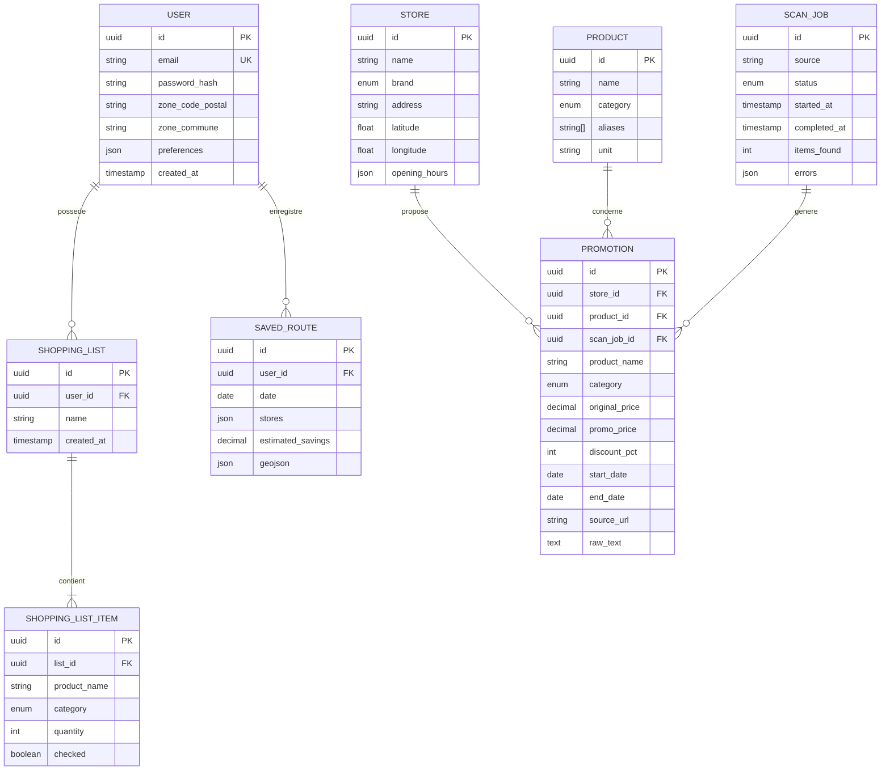
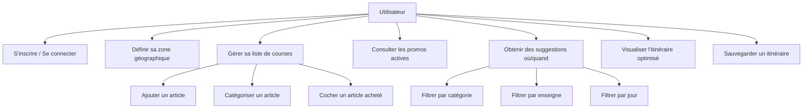
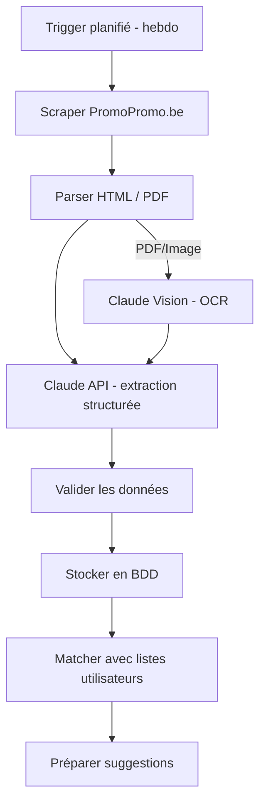

# Fondations du Projet — PromoScan
> mentalyas · Full-Stack Dev
> Date : 2026-06-05
> Statut : Brainstorm initial

---

## 1. Concept Global

PromoScan est une application web de veille promotionnelle intelligente pour le marché belge. Elle collecte automatiquement les folders/dépliants promotionnels des grandes enseignes (Colruyt, Delhaize, Lidl, Aldi, Carrefour, Action), analyse les offres via IA, et suggère à l'utilisateur un plan de courses optimisé : **où acheter, quand y aller, et quel itinéraire suivre** pour maximiser les économies en fonction de sa liste de courses et de sa zone géographique.

Le projet sert à la fois d'outil personnel, d'application grand public (ménages, étudiants, familles) et de pièce portfolio démontrant une architecture full-stack moderne avec pipeline IA.

---

## 2. Fonctionnalités

### Fonctionnalités core (MVP)
- [ ] **F1 — Collecte automatique des folders** : pipeline n8n qui scrape les promotions chaque semaine (source primaire : PromoPromo.be, fallback : sites enseignes + OCR PDF)
- [ ] **F2 — Analyse IA des offres** : extraction structurée via Claude API (produit, prix, prix barré, catégorie alimentaire, dates de validité, enseigne)
- [ ] **F3 — Liste de courses personnalisable** : l'utilisateur crée/gère sa liste par catégories (protéines, légumes, fruits, produits laitiers, etc.)
- [ ] **F4 — Suggestions "où et quand"** : matching entre la liste de courses et les promos actives, avec recommandation par enseigne et par jour de la semaine
- [ ] **F5 — Itinéraire optimisé** : calcul d'un parcours multi-magasins basé sur la zone géographique (commune/code postal) via Leaflet + API routing

### Fonctionnalités secondaires (v2+)
- [ ] **F6 — Historique des prix** : tracking de l'évolution du prix d'un produit dans le temps
- [ ] **F7 — Alertes/notifications** : push ou email quand une promo matche un produit de la liste
- [ ] **F8 — Comparateur de prix en temps réel** : vue comparative inter-enseignes pour un même produit
- [ ] **F9 — Dimension communautaire** : partage de bons plans entre utilisateurs
- [ ] **F10 — PWA** : Progressive Web App installable sur mobile
- [ ] **F11 — Monétisation freemium** : 1 semaine gratuite, puis abonnement abordable

### Hors scope (explicitement exclu)
- Application mobile native (iOS/Android)
- Paiement en ligne / e-commerce
- Programme de fidélité / cashback
- Livraison de courses

---

## 3. Structure de Base de Données

### Entités principales

| Entité | Champs clés | Relations |
|--------|-------------|-----------|
| **User** | id, email, password_hash, zone_code_postal, zone_commune, preferences, created_at | → ShoppingList, → SavedRoute |
| **Store** | id, name, brand (enum), address, latitude, longitude, opening_hours | → Promotion |
| **Promotion** | id, store_id, product_name, category, original_price, promo_price, discount_pct, start_date, end_date, source_url, raw_text | → Store |
| **Product** | id, name, category, aliases[], unit | → Promotion (via matching) |
| **ShoppingList** | id, user_id, name, created_at | → ShoppingListItem |
| **ShoppingListItem** | id, list_id, product_name, category, quantity, checked | → ShoppingList |
| **ScanJob** | id, source, status, started_at, completed_at, items_found, errors | (log pipeline) |
| **SavedRoute** | id, user_id, date, stores[], estimated_savings, geojson | → User |

### Diagramme ERD (Mermaid)

---

## 4. Diagrammes Use Cases (Mermaid)

### Use Case — Utilisateur

### Use Case — Pipeline automatisé

---

## 5. Stack Technologique Recommandée

| Couche | Technologie | Justification |
|--------|-------------|---------------|
| **Frontend** | React + TypeScript + Tailwind CSS | Stack principale mentalyas, portfolio-ready, écosystème riche |
| **Backend** | Node.js (Express) + TypeScript | Cohérence full-stack TS, facilite le partage de types |
| **Base de données** | PostgreSQL | Relationnel robuste, support géospatial (PostGIS), JSON natif |
| **ORM** | Prisma | Type-safe, migrations auto, excellent DX avec TypeScript |
| **Auth** | JWT (access + refresh tokens) | Standard API+SPA, stateless |
| **Pipeline collecte** | n8n (Docker) | Déjà maîtrisé (projet VT), workflows visuels, planification native |
| **IA — Analyse** | Claude API (Haiku pour volume, Sonnet pour analyse fine) | Déjà intégré dans pipeline VT, excellent pour extraction structurée |
| **IA — OCR** | Claude Vision API | Extraction texte depuis images/PDF de folders |
| **Cartographie** | Leaflet + OpenRouteService | Open source, gratuit, migration Google Maps possible en v2 |
| **State management** | Zustand | Léger, simple, recommandé dans la stack frontend mentalyas |
| **Data fetching** | TanStack Query | Cache, invalidation, optimistic updates |
| **Forms** | React Hook Form + Zod | Validation type-safe côté client |
| **Hébergement** | Vercel (frontend) + Railway/Render (API+DB) | Vercel apprécié par mentalyas, Railway pour le backend |
| **Pipeline hosting** | Docker (n8n self-hosted) | Même setup que le projet VT |
| **CI/CD** | GitHub Actions | Intégré à GitHub, gratuit pour projets publics |

### Réutilisation du projet VT (AIHorizonScanning)

| Brique VT | Adaptation PromoScan |
|-----------|---------------------|
| Pipeline n8n (RSS → Claude → Filter → CSV) | Scraping → Claude → Filter → PostgreSQL |
| Docker Compose (api + db + n8n) | Même orchestration locale |
| Pattern "IA comme filtre/analyseur" | IA pour extraction promos + catégorisation |
| Architecture API + Frontend | Base structurelle adaptée |

---

## 6. Algorithmes & Patterns Techniques

- **Fuzzy Matching (correspondance approximative)** — Pour matcher les noms de produits entre la liste de courses et les promos extraites. Ex : "poulet" matche "filet de poulet", "blanc de poulet". Librairie : `fuse.js` côté serveur.

- **TSP Heuristic (Travelling Salesman Problem — Problème du voyageur de commerce)** — Pour optimiser l'itinéraire multi-magasins. On utilise une heuristique gloutonne (nearest neighbor) car le nombre de stops est faible (2-5 magasins). Pas besoin d'algo exact.

- **Scoring pondéré multi-critères** — Pour classer les suggestions : `score = (économie * w1) + (proximité * w2) + (nb_articles_trouvés * w3)`. Les poids sont configurables par l'utilisateur (priorité budget vs distance).

- **Pipeline ETL (Extract-Transform-Load)** — Pattern classique pour la collecte : Extract (scraping/OCR) → Transform (Claude API, normalisation) → Load (PostgreSQL). Orchestré par n8n.

- **CQRS léger (Command Query Responsibility Segregation)** — Séparer les écritures (pipeline qui insère les promos) des lectures (API qui sert les suggestions). PostgreSQL gère les deux, mais les endpoints sont distincts.

- **Geocoding & Reverse Geocoding** — Convertir code postal/commune en coordonnées GPS pour le calcul de distances. API : OpenStreetMap Nominatim (gratuit).

---

## 7. Sécurité — Bloc Dédié

### Niveau de sensibilité des données
**Moyen** — Données personnelles (email, zone géographique, habitudes alimentaires), pas de données financières directes. RGPD applicable (utilisateurs belges/européens).

### Vulnérabilités à anticiper

| Risque | Vecteur | Mitigation |
|--------|---------|------------|
| Injection SQL | Entrées utilisateur (liste courses, recherche) | Prisma ORM (requêtes paramétrées natives) |
| XSS | Affichage de données scrapées (noms produits, textes promos) | Sanitization React (échappement natif JSX) + CSP headers |
| CSRF | Mutations API | SameSite cookies + CORS strict |
| Scraping abusif | Endpoints API publics | Rate limiting (express-rate-limit), pagination |
| Fuite de clés API | Claude API key, DB credentials | Variables d'env, .env.example sans valeurs |
| RGPD | Stockage localisation, profiling alimentaire | Zone approximative (code postal), consentement explicite, droit de suppression |
| Dépendance scraping | Sites enseignes changent leur structure | Monitoring des jobs, alertes sur taux d'erreur, fallback OCR |

### Exceptions & Gestion d'erreurs
- Ne jamais exposer les stack traces en production.
- Messages d'erreur génériques pour l'utilisateur final.
- Logging structuré côté serveur (sans données sensibles).
- Les erreurs de scraping ne doivent jamais impacter l'expérience utilisateur (données en cache).
- Timeout et retry policy sur les appels Claude API.

### Checklist sécurité minimale
- [ ] Authentification sécurisée (hash bcrypt, JWT avec expiration courte)
- [ ] HTTPS obligatoire (Vercel/Railway = natif)
- [ ] Variables d'env pour tous les secrets (Claude API key, DB URL, JWT secret)
- [ ] Rate limiting sur les endpoints sensibles (auth, API publique)
- [ ] Validation des entrées côté serveur (Zod)
- [ ] CORS whitelist (uniquement le domaine frontend)
- [ ] Consentement RGPD à l'inscription (zone géo, cookies)
- [ ] Endpoint de suppression de compte (droit à l'oubli)
- [ ] Sanitization des données scrapées avant insertion en BDD
- [ ] Pas de PII (Personally Identifiable Information) dans les logs

---

## 8. Références

| Référence | Ce qui est inspirant | Ce qu'on fait différemment |
|-----------|---------------------|---------------------------|
| [**myShopi**](https://apps.apple.com/us/app/myshopi-leaflets-promos/id406663341) | App belge #1, folders digitaux, liste de courses | PromoScan ajoute l'IA d'analyse + optimisation itinéraire + suggestions temporelles |
| [**PromoPromo.be**](https://www.promopromo.be/fr) | Agrégateur de folders belges, toutes enseignes | Utilisé comme source de données, pas comme concurrent direct |
| [**Too Good To Go**](https://www.toogoodtogo.com/) | UX mobile-first, géolocalisation, notifications | Inspiration UX pour les suggestions contextuelles |
| [**AIHorizonScanning (projet VT)**](https://github.com/ernesthdj/AIHorizonScanning) | Pipeline n8n + Claude API, Docker Compose, architecture | Réutilisation directe de l'archi et du pattern pipeline |
| [**Colruyt — Meilleurs Prix**](https://www.colruyt.be/fr/meilleurs-prix/comparaison-prix) | Comparaison de prix officielle Colruyt | PromoScan est cross-enseignes, pas limité à un seul retailer |
| [**colruyt_scraper (GitHub)**](https://github.com/SimonGulix/colruyt_scraper) | API cachée Colruyt documentée | Référence technique pour le scraping Colruyt spécifiquement |

---

## 9. Vers le Cahier des Charges

### Résumé exécutif (pour business plan)

Les consommateurs belges perdent du temps et de l'argent à consulter manuellement les folders de chaque enseigne. PromoScan résout ce problème en centralisant automatiquement les promotions, en les analysant par IA, et en générant des plans de courses optimisés (lieu, jour, itinéraire). Le marché cible est le grand public belge (ménages, étudiants, familles) — un marché de 4.8M de ménages. Le modèle économique envisagé est le freemium avec abonnement abordable après 1 semaine d'essai.

### Points ouverts / décisions restantes
- [ ] Fréquence exacte de collecte (hebdo vs bi-hebdo vs quotidien)
- [ ] Choix du service de routing (OpenRouteService vs OSRM vs GraphHopper)
- [ ] Stratégie de matching produits (fuzzy search vs embeddings IA vs taxonomie manuelle)
- [ ] Hébergement du pipeline n8n en production (VPS dédié vs container cloud)
- [ ] Design UI/UX — wireframes et maquettes
- [ ] Aspects légaux du scraping (CGU des sites, robots.txt)
- [ ] Gestion du multi-langue (FR/NL pour le marché belge)

### Prochaines étapes
1. Valider ce document de fondation
2. Activer l'équipe d'agents IT pour l'implémentation
3. Agent #1 (PO) → User Stories + Definition of Done
4. Agent #2 (Architect) → Architecture détaillée + schéma API
5. Agent #3 (UI/UX) → Wireframes + Design System
6. Prototyper le pipeline n8n de collecte (proof of concept)
