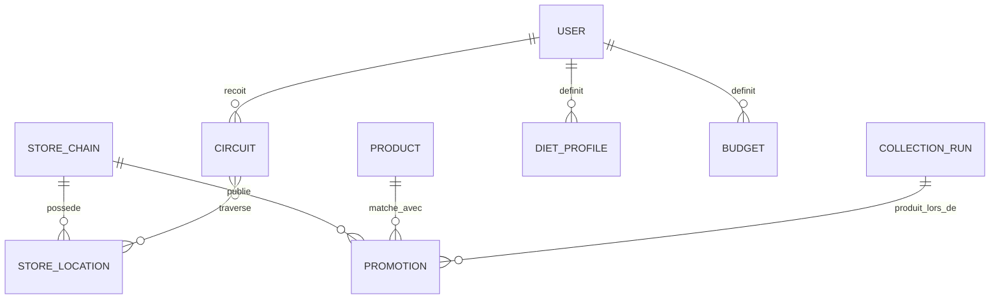
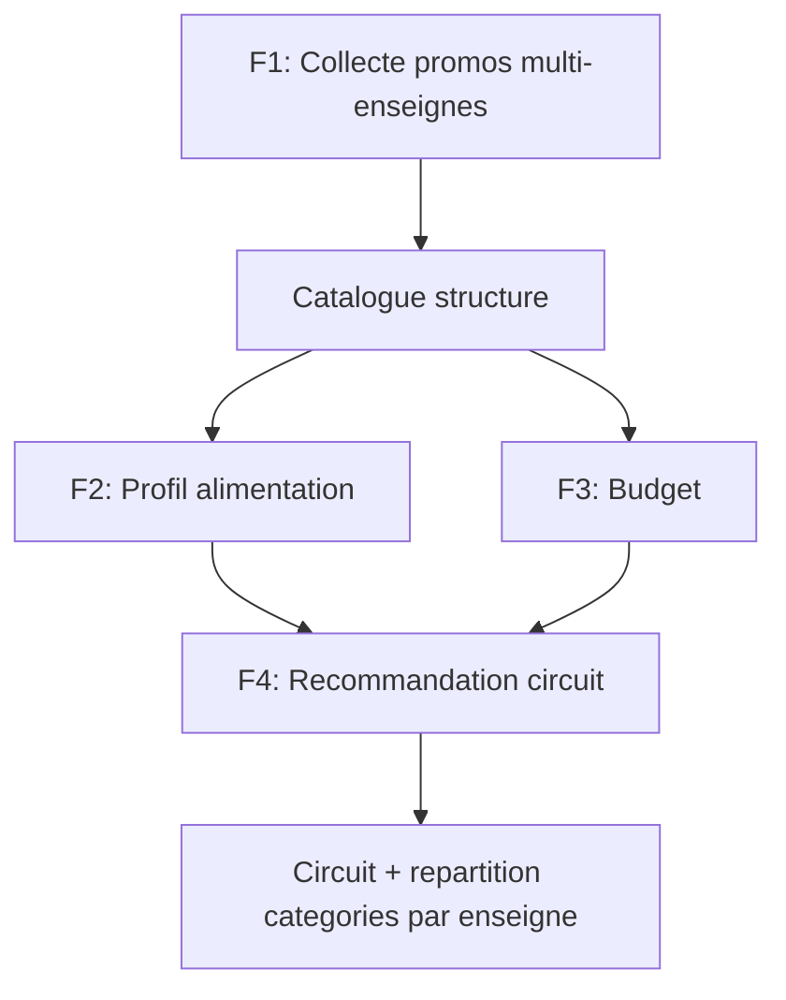

# Cahier des Charges — PromoScan
> mentalyas · Full-Stack Dev
> Date : 2026-08-08
> Statut : Niveaux 1+2+3 — **F1 (Collecte & structuration des promotions) détaillé en profondeur ; F2, F3, F4 restent au niveau 1 (vision) et seront approfondis dans une itération ultérieure du brainstorm.**
> Niveaux exécutés : `docs/brainstorm/L1-fondation.md`, `docs/brainstorm/L2-f1-collecte-promotions.md`, `docs/brainstorm/L3-f1-collecte-promotions.md`

---

## 1. Concept Global

PromoScan est un assistant qui scanne automatiquement les promotions de plusieurs enseignes alimentaires belges (actuellement diffusées sous forme de folders papier ou PDF/HTML, fastidieux à consulter et comparer manuellement) et transforme cette information brute en une solution de courses prête à l'emploi. À partir d'un profil alimentaire (général ou basé sur des recettes précises) et d'un budget, l'app calcule le meilleur circuit de magasins à faire dans une région donnée, en répartissant les catégories de produits (fruits/légumes, protéines, etc.) sur les enseignes les plus intéressantes selon leurs promos du moment. Le MVP est utilisé en solo par mentalyas pour valider l'usage réel ; l'objectif à terme est un déploiement grand public destiné aux familles.

## 2. Fonctionnalités

### Fonctionnalités core (MVP) — ordre de développement volontaire
L'ordre ci-dessous n'est pas arbitraire : F1 conditionne la faisabilité et la conception de toutes les fonctionnalités suivantes — c'est pourquoi elle est la seule détaillée en profondeur (L2+L3) à ce stade.

- [ ] **F1 — Collecte & structuration des promotions** ✅ *détaillé L1+L2+L3, prêt pour implémentation*. Scan direct des sites officiels des enseignes belges (Colruyt, Delhaize, Aldi, Lidl), extraction et normalisation en catalogue structuré.
- [ ] **F2 — Profil alimentation** *(niveau 1 seulement)* : définir un type d'alimentation général, ou une liste de recettes précises à préparer.
- [ ] **F3 — Budget** *(niveau 1 seulement)* : définir une enveloppe budgétaire pour la période de courses.
- [ ] **F4 — Recommandation de circuit de magasins** *(niveau 1 seulement, signal fort niveau 3 anticipé)* : sur base de F1+F2+F3 et d'une région choisie, proposer le meilleur circuit/combo de magasins, avec répartition des catégories de produits selon les enseignes les plus avantageuses.

### Fonctionnalités secondaires (v2+)
- [ ] **F5 — Habitudes alimentaires permanentes** : verrouiller un profil récurrent (type d'alimentation + budget habituels).
- [ ] **F6 — Notifications proactives** : alerter quand une offre intéressante correspond au profil verrouillé.
- [ ] **F7 — Suggestion du meilleur jour de la semaine** pour faire les courses, en fonction des promos actives.
- [ ] Auth sociale, multi-profils par foyer — piste évoquée, non retenue tant que F1-F4 solo n'est pas validé.

### Hors scope (explicitement exclu pour le MVP)
- Paiement / abonnement in-app
- Application mobile native (le MVP est PWA — Progressive Web App)
- Extension géographique hors Belgique
- Comparateur produit-par-code-barres façon PingPrice (hors périmètre — PromoScan planifie un circuit, ne compare pas un scan ponctuel)

## 3. Structure de Base de Données

> Le détail ci-dessous couvre **F1 uniquement** (niveau 3 validé). Les entités liées à F2/F3/F4 (DietProfile, Budget, Circuit) restent provisoires — hypothèse de travail issue du niveau 1, à affiner quand ces fonctionnalités seront détaillées à leur tour.

### Entités F1 — détaillées (niveau 3)
| Table | Colonnes | Contraintes | Index |
|-------|----------|-------------|-------|
| `StoreChain` | id, slug, name, strategy (`api`\|`html`\|`headless`), baseUrl, isActive | slug unique | — |
| `Product` | id, canonicalName, category, aliases (string[]) | — | GIN sur aliases (ou `pg_trgm` si recherche floue) |
| `Promotion` | id, storeChainId (FK), productId (FK nullable), rawProductName, category, unitLabel, regularPrice, promoPrice, discountPercent, pricePerUnit, validFrom, validTo, sourceUrl, collectedAt | **unique(storeChainId, rawProductName, validFrom)** | (storeChainId, validFrom), (productId) |
| `CollectionRun` | id, startedAt, finishedAt, status (`running`\|`partial`\|`complete`\|`failed`), resultsByChain (JSON) | — | (startedAt desc) |

### Entités F2/F3/F4 — provisoires (niveau 1, non affinées)
| Entité | Champs clés | Relations |
|--------|-------------|-----------|
| User | id, email, password_hash (Supabase Auth) | 1-N DietProfile, 1-N Budget |
| DietProfile | id, userId, type (général/recettes), recettes[] | N-1 User |
| Budget | id, userId, montant, periode | N-1 User |
| Circuit | id, userId, region, magasins[], repartitionCategories | N-1 User |
| StoreLocation *(hors périmètre F1 — nécessaire pour F4 uniquement)* | id, storeChainId, adresse, lat/lng | N-1 StoreChain, source à définir (probablement store locator séparé du flux promo) |

### Diagramme ERD (Mermaid)


## 4. Diagrammes Use Cases — Vue d'ensemble (Mermaid)


## 5. Stack Technologique Recommandée

| Couche | Technologie | Justification |
|--------|-------------|----------------|
| Framework full-stack | Next.js (App Router) | Un seul projet (frontend + API via Route Handlers/Server Actions), déploiement natif Vercel |
| Hébergement | Vercel (projet unique) | Compte existant, gratuit pour ce volume |
| Scraping/extraction planifiée | Vercel Cron Jobs | Remplace n8n en production — décision explicite, pas de service séparé à héberger 24/7 |
| Rendu JS pour scraping (Delhaize, Lidl) | Playwright + `@sparticuz/chromium` (compatible serverless) | Ces 2 enseignes exposent leurs promos via composants JS, pas de HTML brut exploitable |
| Base de données | Supabase Postgres (intégration Marketplace Vercel) | Compte existant. Fournit aussi Auth et Storage |
| Authentification | Supabase Auth | Remplace le JWT + refresh token custom de la v1 |
| ORM | Prisma | Repris de la v1, mature et documenté |
| Extraction IA (fallback formats non structurés) | Claude API (Vision) | Pour d'éventuels folders PDF/image purs si une enseigne future n'a pas de source web structurée |
| Notifications (v2) | Web Push (service worker, VAPID) | Gratuit, cohérent avec le choix PWA |
| Géocodage / itinéraire (F4) | Nominatim (OSM) + Haversine SQL | Suffisant pour 2-6 arrêts |
| Frontend UI | React + TypeScript strict + Tailwind + Zustand + TanStack Query + React Hook Form + Zod | Conforme au standard global |
| PWA | manifest.json + service worker (`next-pwa` ou config manuelle) | Installable mobile, notifications push, sans app store |

## 6. Algorithmes & Patterns Techniques
- **Adaptateur par enseigne (Strategy pattern)** — chaque `StoreAdapter` (Colruyt/Aldi/Delhaize/Lidl) implémente la même interface `fetchPromotions()` quelle que soit sa stratégie technique interne (API JSON directe pour Colruyt, HTML statique pour Aldi, rendu headless pour Delhaize/Lidl). L'orchestrateur de collecte ne connaît jamais le détail d'implémentation.
- **Pipeline ETL avec tolérance de panne partielle** — Extract (adaptateur) → Validate (Zod) → Load (upsert idempotent). Une enseigne en échec n'affecte jamais les autres ; une dérive de format (0 résultat inattendu) est détectée et n'écrase pas le catalogue existant.
- **Matching produit ↔ recette/liste de courses** (F4) — fuzzy matching (Fuse.js) ou recherche full-text Postgres (`pg_trgm`), à trancher selon le volume/qualité réel des données collectées par F1.
- **Allocation catégorie → enseigne** (F4) — pour chaque catégorie de produit, sélectionner l'enseigne avec le meilleur ratio promo/besoin, sous contrainte du budget global (proche d'un problème d'allocation sous contrainte, type knapsack simplifié).
- **Optimisation de circuit** (F4) — heuristique nearest-neighbor, suffisant pour 2-6 magasins.

## 7. Sécurité — Bloc Dédié

### Niveau de sensibilité des données
Faible à moyen. Compte utilisateur (email/mot de passe via Supabase Auth), localisation approximative (région), habitudes alimentaires. Pas de paiement, pas de donnée de santé/bancaire en MVP. Relève du RGPD standard.

### Vulnérabilités à anticiper (macro, tout le projet)
| Risque | Vecteur | Mitigation |
|--------|---------|------------|
| Injection SQL | Requêtes sur catalogue produits/promotions | Prisma (requêtes paramétrées) |
| XSS | Contenu de promotions scrapé affiché en front | Sanitization stricte du contenu scrapé avant stockage/affichage |
| Auth faible | Comptes utilisateurs | Supabase Auth |
| Abus de scraping | Cron jobs trop agressifs sur les sites enseignes | Respect `robots.txt`/`crawl-delay` par enseigne (voir F1), cache agressif |
| Fuite de données géo | Localisation utilisateur | Région/code postal, pas de GPS précis tant que non nécessaire |

### Sécurité spécifique F1 (niveau 3)
| Risque | Vecteur | Mitigation |
|--------|---------|------------|
| Déclenchement abusif de la collecte | Endpoint `/api/cron/collect-promotions` appelé depuis l'extérieur | Vérification du secret `CRON_SECRET` (Vercel Cron natif), 401 sinon |
| Clé API Colruyt invalide/expirée | Clé `X-CG-APIKEY` extraite dynamiquement d'une page publique, pas une vraie clé secrète stable | Extraction à la volée à chaque run, échec = enseigne marquée en échec (pas de blocage global) |
| Exécution de navigateur headless en serverless | Playwright + Chromium dans une fonction Vercel | Package dédié serverless (`@sparticuz/chromium`), timeout explicite, aucun script tiers non contrôlé exécuté |
| Fuite via les logs de collecte | Contenu brut des pages scrapées | Logger uniquement statut/nombre d'items/code d'erreur, jamais le contenu brut |
| Blocage IP par une enseigne | Fréquence de collecte trop agressive | `crawl-delay` respecté par enseigne, User-Agent identifiable, un run hebdomadaire par défaut |

### Checklist sécurité minimale
- [ ] Authentification sécurisée via Supabase Auth
- [ ] HTTPS obligatoire (natif Vercel)
- [ ] Variables d'env pour tous les secrets (Supabase keys, Claude API key, `CRON_SECRET`)
- [ ] Rate limiting / crawl-delay respecté sur les crons de scraping
- [ ] Validation des entrées côté serveur (Zod), y compris les données scrapées avant insertion

## 8. Références

| Référence | Ce qui est inspirant | Ce qu'on fait différemment |
|-----------|----------------------|------------------------------|
| [PromoPromo](https://www.promopromo.be/fr/categories/supermarche) | Agrégateur belge de folders promo par enseigne — concurrent direct le plus proche en Belgique | Vérifié techniquement non-exploitable comme source de données (voir F1) : s'arrête à l'affichage de couvertures de brochures, données produit derrière des URLs interdites au crawl. Pas de profil alimentation/budget/circuit |
| [myShopi](https://www.myshopi.com/) | Application belge #1 pour folders digitaux + liste de courses | Pas de profil alimentaire/recettes, pas de budget contraint, pas de circuit optimisé multi-enseignes |
| [PingPrice / G4U](https://www.retaildetail.be/fr/news/food/lapplication-belge-g4u-apporte-une-transparence-radicale-des-prix-dans-les-supermarches/) | Comparaison de prix produit par produit entre enseignes belges | Scan ponctuel produit par produit, pas de planification de courses ni d'itinéraire ; G4U payant |
| [Test-Achats — calculateur supermarché le moins cher](https://www.test-achats.be/famille-prive/supermarches/calculateur/le-supermarche-le-moins-cher-de-votre-quartier) | Calcul du supermarché le moins cher pour un panier donné | Un seul magasin recommandé, pas de circuit multi-enseignes ni de répartition par catégorie |
| [Flipp](https://apps.apple.com/) (US/Canada) | Référence internationale : agrège les folders hebdomadaires de centaines d'enseignes | Pas de planification de circuit multi-arrêts ni de profil alimentaire/recette |
| [Grocery Routes / CartSage](https://www.groceryroutes.com/grocery-price-comparison-app/) | Calcule des circuits à 1-3 magasins à partir d'une liste de courses complète — concept le plus proche de F4 | Ne part pas d'un profil alimentaire/recettes ni d'un budget contraint ; marché nord-américain |

## 9. Détail par Fonctionnalité (Niveau 2) — F1 uniquement

### 9.1 F1 — Collecte & structuration des promotions

**Objectif :** Récupérer automatiquement, de façon planifiée, les promotions alimentaires directement sur les sites officiels des enseignes belges (Colruyt, Delhaize, Aldi, Lidl), et les transformer en catalogue interne structuré. Socle technique de tout le reste de l'app.

> Pivot de stratégie (2026-08-08) : PromoPromo.be envisagé initialement comme source unique — écarté après vérification technique (données produit derrière des URLs `?offer=` interdites par son `robots.txt`, brochures scannées sans gain réel vs sources directes). Décision : scraper directement les sites des enseignes.

**Use cases :**
- **UC-1 — Déclenchement planifié** : Vercel Cron hebdomadaire itère sur les enseignes configurées, récupère leurs pages/API promo dans le respect du `crawl-delay` propre à chaque site.
- **UC-2 — Extraction structurée HTML** : parsing des pages, extraction produit/prix/dates/catégorie, validation, upsert. Rejet loggé si donnée obligatoire manquante ou dérive de format détectée (0 résultat inattendu).
- **UC-3 — Extraction via IA (fallback PDF/image)** : Claude Vision pour tout document non-HTML structuré, réponse validée contre le schéma avant insertion.
- **UC-4 — Tolérance de panne partielle** : un échec d'enseigne est isolé, les autres continuent, les dernières données valides connues sont conservées (jamais de suppression silencieuse).
- **UC-5 — Interface de contrôle** : page protégée (Supabase Auth) permettant de lister les promotions collectées (filtrable enseigne/catégorie), consulter l'historique des `CollectionRun`, et déclencher une collecte manuelle à la demande.

**Règles métier clés :**
1. Respecter le `robots.txt` de chaque enseigne — jamais de crawl d'un chemin/paramètre explicitement disallow.
2. Respecter le `crawl-delay` propre à chaque site quand spécifié.
3. Une enseigne/page en échec ne bloque jamais la collecte des autres.
4. Ne jamais écraser le catalogue existant avec un résultat vide/suspect.
5. PromoPromo.be n'est plus une source de données — conservé uniquement comme référence concurrentielle.

**Contraintes `robots.txt` par enseigne (vérifié 2026-08-08) :**
| Enseigne | Chemins/paramètres interdits pertinents | Crawl-delay | Risque |
|----------|------------------------------------------|-------------|--------|
| Colruyt | `/content/clp` (JSON sous ce chemin autorisé) | 5s | Faible |
| Delhaize | `*/search/*`, `*/customerhub/quick-shop/*` | Non spécifié | Faible |
| Aldi | `/mds/`, `/*?*filters`, `/*?*jobId=` | Non spécifié | Faible à moyen |
| Lidl | `*search?q=*`, `*?offset=*`, `*sort=*`, `*id=*`, `*pageId=*` | Non spécifié | Vérifié non-bloquant sur l'URL promo réelle utilisée (segment de chemin, pas query param) |

**Faisabilité technique par enseigne (vérifiée en conditions réelles, navigateur) :**
| Enseigne | Constat | Approche retenue |
|----------|---------|-------------------|
| Colruyt | SPA, mais API JSON interne documentée publiquement (`ecgproductmw.colruyt.be`), clé `X-CG-APIKEY` récupérable au chargement | Client HTTP direct vers l'API — le plus léger |
| Aldi | HTML server-rendered classique | Scraping HTML direct |
| Delhaize | Données riches confirmées (1062 produits, groupées par catégorie alimentaire), chargées via `delhaize.be/api/v1/...` (composant `CmsProductList`), pas dans le HTML brut initial | Rendu headless (Playwright) ou reverse engineering de l'API |
| Lidl | Données très riches confirmées (prix, %, prix/kg, dates, origine) — hypothèse initiale de blocage infirmée (limite de l'outil de vérification, pas du site) | Rendu headless (Playwright) |

**Critères d'acceptation (DoD) :**
- [x] `robots.txt` des 4 enseignes vérifié
- [x] Faisabilité technique des 4 enseignes vérifiée en conditions réelles
- [ ] Au moins une enseigne collectée de bout en bout (Colruyt ou Aldi en premier)
- [ ] Au moins une enseigne headless (Delhaize ou Lidl) collectée de bout en bout
- [ ] Panne simulée sur une enseigne n'empêche pas la collecte des autres
- [ ] Dérive de format déclenche une alerte sans vider le catalogue existant
- [ ] Interface protégée (`/dashboard/collecte`) permettant de lister les promotions, consulter l'historique des runs, et déclencher une collecte manuelle

## 10. Conception Technique (Niveau 3) — F1 uniquement

### 10.1 F1 — Collecte & structuration des promotions

**Contrat API (interne) :**
| Endpoint | Méthode | Entrée | Sortie | Codes d'erreur |
|----------|---------|--------|--------|-----------------|
| `/api/cron/collect-promotions` | POST | Header `Authorization: Bearer <CRON_SECRET>` | `{ success, data: { runId, statusByChain } }` | 401, 409 (run déjà en cours), 500 |
| `/api/promotions` | GET | Query `storeChain`, `category`, `page`, `limit` (auth session) | `{ success, data: { items, total, page } }` | 401 |
| `/api/collection-runs` | GET | Query `page`, `limit` (auth session) | `{ success, data: { items, total } }` | 401 |
| `/api/collections/trigger` | POST | Session utilisateur valide | Même corps que `/api/cron/collect-promotions` | 401, 409 |

**Interface de contrôle** : page `/dashboard/collecte`, protégée par Supabase Auth (même mécanisme que le reste de l'app) — liste des promotions filtrable, historique des runs, déclenchement manuel.

**Interface commune StoreAdapter :**
```ts
interface StoreAdapter {
  chainSlug: string;
  strategy: "api" | "html" | "headless";
  fetchPromotions(): Promise<RawPromotion[]>;
}
interface RawPromotion {
  rawProductName: string; category: string | null; unitLabel: string | null;
  regularPrice: number | null; promoPrice: number; discountPercent: number | null;
  pricePerUnit: number | null; validFrom: string; validTo: string;
  sourceUrl: string; originLabel: string | null;
}
```

**Séquence :** Cron → vérifie qu'aucun `CollectionRun` n'est `running` → crée le run → pour chaque `StoreChain` active, appelle l'adaptateur → valide (Zod) → détecte anomalie (0 résultat vs run précédent > 0) sans écraser → upsert par `(storeChainId, rawProductName, validFrom)` → clôture le run en `partial`/`complete`.

**Cas limites techniques :**
- Concurrence : garde en base (pas juste mémoire) contre les runs qui se chevauchent, avec timeout de secours si un run reste bloqué en `running`.
- Idempotence : contrainte unique `(storeChainId, rawProductName, validFrom)` → rejeu = upsert, jamais de doublon.
- Transactions : une transaction par enseigne (tout ou rien), pas de transaction globale inter-enseignes.
- Volumétrie : ~1000+ produits par enseigne possibles (constaté chez Delhaize) → pagination à gérer, temps d'exécution potentiellement au-delà d'une seule invocation pour les enseignes headless → envisager un cron par enseigne plutôt qu'un orchestrateur séquentiel unique (décision à confirmer à l'implémentation selon temps mesurés).

**Sécurité spécifique :** voir section 7 (bloc consolidé).

## 12. Résumé exécutif & Statut

### Résumé exécutif
Les folders promo (papier ou digitaux) restent un format brut que personne ne compare sérieusement entre enseignes chaque semaine. PromoScan digère cette information et la transforme directement en circuit de courses actionnable, adapté au profil alimentaire et au budget de l'utilisateur. MVP solo (mentalyas) pour valider l'usage réel avant un déploiement grand public visant les familles en Belgique. La fonctionnalité la plus risquée techniquement (collecte de données promo multi-enseignes) a été vérifiée en conditions réelles et confirmée faisable pour les 4 enseignes ciblées.

### Points ouverts / décisions restantes
- [ ] Choix définitif matching produit (Fuse.js vs `pg_trgm` Postgres) — dépendant du volume/qualité de données récupérées via F1 en conditions réelles
- [ ] Granularité de la localisation utilisateur (région vs code postal vs GPS) à trancher lors du design F4
- [ ] Architecture exacte du cron (orchestrateur unique vs cron par enseigne) — à confirmer selon les temps d'exécution mesurés à l'implémentation
- [ ] F2, F3, F4 restent à détailler (niveau 2, et niveau 3 pour F4) avant leur implémentation

### Prochaines étapes
1. Activer l'équipe d'agents IT (Hub & Spoke) pour l'implémentation du spike F1 — Backend (#4) peut démarrer directement sur la base de la section 10.1.
2. Reprendre `/brainstorm niveau2 [F2|F3|F4]` pour détailler les fonctionnalités restantes avant leur implémentation, en parallèle ou après le spike F1.
