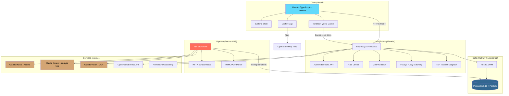

# Architecture — PromoScan
> Agent #2 — Software Architect
> Date : 2026-06-05
> Source : FONDATION-PROMOSCAN.md + stories.md (25 stories, 108 DoD)

---

## A. Schema d'architecture global



### Flux de donnees principaux

1. **Pipeline ETL (hebdomadaire)** : n8n CRON --> Scrape PromoPromo.be --> Parse HTML/PDF --> Claude API extraction structuree --> Validation + sanitization --> INSERT PostgreSQL --> ScanJob log
2. **Suggestions (a la demande)** : Frontend demande --> API recoit liste_id --> Fuse.js match promos actives --> Scoring multi-criteres par enseigne --> Response JSON triee
3. **Itineraire (a la demande)** : Frontend envoie store_ids[] --> API calcule TSP nearest neighbor --> OpenRouteService routing --> GeoJSON response --> Leaflet affichage
4. **Geocoding (au profil)** : Utilisateur saisit code postal --> API appelle Nominatim --> Cache resultat --> Coordonnees sauvegardees en profil

---

## B. Schema BDD finalise

### Enums PostgreSQL

```sql
-- Enseignes belges ciblees
CREATE TYPE brand_enum AS ENUM (
    'colruyt', 'delhaize', 'lidl', 'aldi', 'carrefour', 'action'
);

-- Categories alimentaires/produits
CREATE TYPE category_enum AS ENUM (
    'proteines', 'legumes', 'fruits', 'produits_laitiers',
    'boulangerie', 'boissons', 'epicerie', 'surgeles',
    'hygiene', 'entretien', 'autres'
);

-- Statut des jobs de collecte
CREATE TYPE scan_status_enum AS ENUM (
    'running', 'completed', 'failed', 'partial'
);

-- Role utilisateur (v2+ admin panel)
CREATE TYPE user_role_enum AS ENUM (
    'user', 'admin'
);
```

### Index strategy

| Table | Colonne(s) | Type d'index | Justification |
|-------|------------|--------------|---------------|
| `promotion` | `start_date, end_date` | B-tree composite | Filtre promos actives (WHERE now() BETWEEN start_date AND end_date) |
| `promotion` | `store_id` | B-tree | JOIN avec Store pour grouper par enseigne |
| `promotion` | `category` | B-tree | Filtre par categorie (US-019) |
| `promotion` | `product_name` | GIN trigram | Fuzzy search (pg_trgm extension, fallback si Fuse.js insuffisant) |
| `store` | `brand` | B-tree | Filtre par enseigne |
| `store` | `location` | GiST (PostGIS) | Recherche par proximite geographique |
| `shopping_list` | `user_id` | B-tree | Lister les listes d'un utilisateur |
| `shopping_list_item` | `list_id` | B-tree | Lister les items d'une liste |
| `saved_route` | `user_id, created_at` | B-tree composite | Historique trie par date |
| `scan_job` | `status` | B-tree | Filtre admin par statut |
| `scan_job` | `started_at` | B-tree DESC | Tri chronologique admin |
| `user` | `email` | Unique | Lookup login + contrainte unicite |

### ERD Mermaid (finalise)

```mermaid
erDiagram
    USER ||--o{ SHOPPING_LIST : "possede"
    USER ||--o{ SAVED_ROUTE : "enregistre"
    USER ||--o{ REFRESH_TOKEN : "detient"
    SHOPPING_LIST ||--|{ SHOPPING_LIST_ITEM : "contient"
    STORE ||--o{ PROMOTION : "propose"
    PRODUCT ||--o{ PROMOTION : "concerne"
    SCAN_JOB ||--o{ PROMOTION : "genere"

    USER {
        uuid id PK "gen_random_uuid()"
        varchar_255 email UK "NOT NULL"
        varchar_255 password_hash "NOT NULL, bcrypt"
        user_role_enum role "DEFAULT 'user'"
        varchar_4 zone_code_postal "CHECK 1000-9999"
        varchar_100 zone_commune
        float8 zone_latitude
        float8 zone_longitude
        jsonb preferences "DEFAULT '{\"w1\":0.5,\"w2\":0.3,\"w3\":0.2}'"
        boolean rgpd_consent "NOT NULL DEFAULT false"
        timestamptz created_at "DEFAULT now()"
        timestamptz updated_at "DEFAULT now()"
    }

    REFRESH_TOKEN {
        uuid id PK
        uuid user_id FK "NOT NULL"
        varchar_512 token_hash "NOT NULL, UNIQUE"
        timestamptz expires_at "NOT NULL"
        timestamptz created_at "DEFAULT now()"
    }

    STORE {
        uuid id PK
        varchar_255 name "NOT NULL"
        brand_enum brand "NOT NULL"
        varchar_500 address "NOT NULL"
        float8 latitude "NOT NULL"
        float8 longitude "NOT NULL"
        geography_point location "PostGIS GENERATED"
        jsonb opening_hours
        boolean is_active "DEFAULT true"
        timestamptz created_at "DEFAULT now()"
    }

    PROMOTION {
        uuid id PK
        uuid store_id FK "NOT NULL"
        uuid product_id FK "NULLABLE"
        uuid scan_job_id FK "NOT NULL"
        varchar_500 product_name "NOT NULL"
        category_enum category "NOT NULL DEFAULT 'autres'"
        numeric_10_2 original_price
        numeric_10_2 promo_price "NOT NULL"
        smallint discount_pct "CHECK 0-100"
        date start_date "NOT NULL"
        date end_date "NOT NULL"
        varchar_1000 source_url
        text raw_text
        timestamptz created_at "DEFAULT now()"
    }

    PRODUCT {
        uuid id PK
        varchar_255 name "NOT NULL, UNIQUE"
        category_enum category "NOT NULL DEFAULT 'autres'"
        varchar_255[] aliases "DEFAULT '{}'"
        varchar_50 unit
        timestamptz created_at "DEFAULT now()"
    }

    SHOPPING_LIST {
        uuid id PK
        uuid user_id FK "NOT NULL"
        varchar_100 name "NOT NULL"
        boolean is_archived "DEFAULT false"
        timestamptz created_at "DEFAULT now()"
        timestamptz updated_at "DEFAULT now()"
    }

    SHOPPING_LIST_ITEM {
        uuid id PK
        uuid list_id FK "NOT NULL, CASCADE"
        varchar_200 product_name "NOT NULL"
        category_enum category "DEFAULT 'autres'"
        smallint quantity "DEFAULT 1, CHECK >= 1"
        boolean checked "DEFAULT false"
        timestamptz created_at "DEFAULT now()"
    }

    SCAN_JOB {
        uuid id PK
        varchar_255 source "NOT NULL"
        scan_status_enum status "NOT NULL DEFAULT 'running'"
        timestamptz started_at "DEFAULT now()"
        timestamptz completed_at
        int items_found "DEFAULT 0"
        int images_processed "DEFAULT 0"
        jsonb errors "DEFAULT '[]'"
        timestamptz created_at "DEFAULT now()"
    }

    SAVED_ROUTE {
        uuid id PK
        uuid user_id FK "NOT NULL"
        varchar_200 name
        jsonb stores "NOT NULL"
        numeric_10_2 estimated_savings "DEFAULT 0"
        jsonb geojson "NOT NULL"
        int estimated_duration_min
        numeric_10_1 estimated_distance_km
        timestamptz created_at "DEFAULT now()"
    }
```

### Ajouts par rapport a la fondation

| Modification | Raison |
|-------------|--------|
| Table `REFRESH_TOKEN` ajoutee | US-001/002 : invalidation cote serveur des refresh tokens (deconnexion, rotation) |
| Champ `USER.role` (enum) | US-007 : endpoint admin pour les scan jobs |
| Champ `USER.zone_latitude/longitude` | Evite de re-geocoder a chaque requete suggestions/itineraire |
| Champ `USER.rgpd_consent` | US-001 : consentement obligatoire a l'inscription |
| Champ `USER.updated_at` | Tracking des modifications profil |
| Champ `STORE.location` (PostGIS geography) | Recherche par proximite performante (ST_DWithin) |
| Champ `STORE.is_active` | Desactiver un magasin sans le supprimer |
| Champ `SHOPPING_LIST.is_archived` | Soft delete sans perte de donnees (US-015) |
| Champ `SCAN_JOB.images_processed` | US-010 : tracking cout Vision API |
| Champs `SAVED_ROUTE.estimated_duration_min/distance_km` | US-023 : resume itineraire avec duree et distance |
| Champ `SAVED_ROUTE.name` | UX : nommer un itineraire sauvegarde |
| Types numeriques precis (`numeric(10,2)`, `smallint`) | Precision financiere, contraintes CHECK |

### Points de vigilance BDD

> **SELFDOUBT** : La colonne `STORE.location` (PostGIS geography) est generee a partir de latitude/longitude. Cela suppose que l'extension PostGIS est disponible sur Railway PostgreSQL. Hypothese probable (Railway supporte les extensions) mais a verifier au deploiement. Fallback : calcul Haversine en SQL pur.

> **SELFDOUBT** : Le champ `PRODUCT.aliases` (varchar[]) est un array PostgreSQL natif. Prisma supporte les arrays PostgreSQL mais le querying est moins performant qu'une table de jointure. Pour le MVP avec un catalogue de quelques milliers de produits, c'est acceptable. En v2+, envisager une table `product_alias` si le volume explose.

---

## C. Endpoints API

Base URL : `/api/v1/`
Format reponse uniforme : `{ success: boolean, data: T | null, error: string | null }`
Pagination : `?page=1&limit=20` (defaut limit=20, max limit=100)
Auth : Bearer token JWT dans header `Authorization`

### Auth

| Methode | Route | Description | Auth | Request Body | Response (data) |
|---------|-------|-------------|------|-------------|-----------------|
| POST | `/auth/register` | Inscription | Non | `{ email, password, zone_code_postal?, rgpd_consent }` | `{ user, accessToken, refreshToken }` |
| POST | `/auth/login` | Connexion | Non | `{ email, password }` | `{ user, accessToken, refreshToken }` |
| POST | `/auth/refresh` | Renouveler access token | Non | `{ refreshToken }` | `{ accessToken, refreshToken }` |
| POST | `/auth/logout` | Deconnexion | Oui | `{ refreshToken }` | `null` |

### Users

| Methode | Route | Description | Auth | Request Body | Response (data) |
|---------|-------|-------------|------|-------------|-----------------|
| GET | `/users/me` | Profil courant | Oui | - | `User` (sans password_hash) |
| PATCH | `/users/me` | Modifier profil (zone, preferences) | Oui | `{ zone_code_postal?, preferences? }` | `User` |
| PATCH | `/users/me/email` | Changer email | Oui | `{ newEmail, password }` | `User` |
| PATCH | `/users/me/password` | Changer mot de passe | Oui | `{ oldPassword, newPassword }` | `null` |
| DELETE | `/users/me` | Supprimer compte (RGPD) | Oui | `{ password }` | `null` |

### Shopping Lists

| Methode | Route | Description | Auth | Request Body | Response (data) |
|---------|-------|-------------|------|-------------|-----------------|
| GET | `/shopping-lists` | Mes listes | Oui | - | `ShoppingList[]` |
| POST | `/shopping-lists` | Creer une liste | Oui | `{ name }` | `ShoppingList` |
| GET | `/shopping-lists/:id` | Detail d'une liste avec items | Oui | - | `ShoppingList & { items: Item[] }` |
| PATCH | `/shopping-lists/:id` | Renommer une liste | Oui | `{ name }` | `ShoppingList` |
| DELETE | `/shopping-lists/:id` | Supprimer une liste | Oui | - | `null` |

### Shopping List Items

| Methode | Route | Description | Auth | Request Body | Response (data) |
|---------|-------|-------------|------|-------------|-----------------|
| POST | `/shopping-lists/:listId/items` | Ajouter un article | Oui | `{ product_name, quantity?, category? }` | `ShoppingListItem` |
| PATCH | `/shopping-lists/:listId/items/:itemId` | Modifier (categorie, quantite, checked) | Oui | `{ category?, quantity?, checked? }` | `ShoppingListItem` |
| DELETE | `/shopping-lists/:listId/items/:itemId` | Supprimer un article | Oui | - | `null` |
| POST | `/shopping-lists/:listId/items/uncheck-all` | Decocher tout | Oui | - | `null` |

### Products (reference)

| Methode | Route | Description | Auth | Request Body | Response (data) |
|---------|-------|-------------|------|-------------|-----------------|
| GET | `/products/search?q=` | Autocompletion produits (min 2 chars) | Oui | - | `Product[]` (max 10) |

### Promotions

| Methode | Route | Description | Auth | Request Body | Response (data) |
|---------|-------|-------------|------|-------------|-----------------|
| GET | `/promotions` | Promos actives (paginee) | Oui | `?category=&brand=&page=&limit=` | `{ items: Promotion[], total, page }` |
| GET | `/promotions/:id` | Detail d'une promo | Oui | - | `Promotion & { store: Store }` |

### Suggestions

| Methode | Route | Description | Auth | Request Body | Response (data) |
|---------|-------|-------------|------|-------------|-----------------|
| POST | `/suggestions/match` | Matching promos pour une liste | Oui | `{ listId, filters?: { categories?, brands?, day? } }` | `MatchResult[]` |
| POST | `/suggestions/recommend` | Recommandation par enseigne (scoring) | Oui | `{ listId, filters? }` | `StoreRecommendation[]` |

Schemas de reponse suggestions :

```typescript
interface MatchResult {
    listItem: { id: string; product_name: string; category: string };
    matches: {
        promotion: Promotion;
        store: Store;
        fuzzyScore: number;
    }[];
}

interface StoreRecommendation {
    store: Store;
    matchedItems: number;
    totalSavings: number;
    distance_km: number;
    score: number;
    promotions: Promotion[];
}
```

### Routes (itineraire)

| Methode | Route | Description | Auth | Request Body | Response (data) |
|---------|-------|-------------|------|-------------|-----------------|
| POST | `/routes/calculate` | Calculer itineraire optimise | Oui | `{ storeIds: string[], origin?: { lat, lng } }` | `RouteResult` |
| GET | `/routes/saved` | Itineraires sauvegardes | Oui | `?page=&limit=` | `{ items: SavedRoute[], total, page }` |
| POST | `/routes/saved` | Sauvegarder un itineraire | Oui | `{ name?, storeIds, geojson, estimated_savings, duration_min, distance_km }` | `SavedRoute` |
| DELETE | `/routes/saved/:id` | Supprimer un itineraire | Oui | - | `null` |

Schema de reponse route :

```typescript
interface RouteResult {
    orderedStores: (Store & { articles: string[] })[];
    totalSavings: number;
    totalDuration_min: number;
    totalDistance_km: number;
    geojson: GeoJSON.FeatureCollection;
    legs: {
        from: string;
        to: string;
        duration_min: number;
        distance_km: number;
    }[];
}
```

### Scan Jobs (admin)

| Methode | Route | Description | Auth | Request Body | Response (data) |
|---------|-------|-------------|------|-------------|-----------------|
| GET | `/admin/scan-jobs` | Liste des jobs (paginee) | Admin | `?status=&page=&limit=` | `{ items: ScanJob[], total, page }` |
| GET | `/admin/scan-jobs/:id` | Detail d'un job | Admin | - | `ScanJob` |
| POST | `/admin/scan-jobs/trigger` | Declencher un scan manuellement | Admin | `{ source?, brands[]? }` | `ScanJob` |

### Geocoding (interne)

| Methode | Route | Description | Auth | Request Body | Response (data) |
|---------|-------|-------------|------|-------------|-----------------|
| GET | `/geo/postal-codes?q=` | Recherche code postal belge | Oui | - | `PostalCode[]` |
| GET | `/geo/geocode?postal_code=` | Geocoder un code postal | Oui | - | `{ lat, lng, commune }` |

### Resume des endpoints

| Domaine | Nombre d'endpoints |
|---------|-------------------|
| Auth | 4 |
| Users | 5 |
| Shopping Lists | 5 |
| Shopping List Items | 4 |
| Products | 1 |
| Promotions | 2 |
| Suggestions | 2 |
| Routes | 4 |
| Scan Jobs (admin) | 3 |
| Geocoding | 2 |
| **Total** | **32** |

### Couverture des stories

| Story | Endpoint(s) couvrant |
|-------|---------------------|
| US-001 | POST /auth/register |
| US-002 | POST /auth/login, /auth/refresh, /auth/logout |
| US-003 | PATCH /users/me, GET /geo/geocode, GET /geo/postal-codes |
| US-004 | GET/PATCH /users/me, PATCH /users/me/email, PATCH /users/me/password, DELETE /users/me |
| US-005 | POST /admin/scan-jobs/trigger (+ n8n cron) |
| US-006 | (pipeline n8n interne, pas d'endpoint) |
| US-007 | GET /admin/scan-jobs, GET /admin/scan-jobs/:id |
| US-008 | (pipeline n8n --> Claude API, pas d'endpoint) |
| US-009 | (pipeline n8n --> Claude API, pas d'endpoint) |
| US-010 | (pipeline n8n --> Claude Vision, pas d'endpoint) |
| US-011 | POST /shopping-lists |
| US-012 | POST /shopping-lists/:listId/items, GET /products/search |
| US-013 | PATCH /shopping-lists/:listId/items/:itemId |
| US-014 | PATCH /shopping-lists/:listId/items/:itemId |
| US-015 | DELETE /shopping-lists/:id, DELETE /shopping-lists/:listId/items/:itemId |
| US-016 | (frontend uniquement, pas d'endpoint) |
| US-017 | POST /suggestions/match |
| US-018 | POST /suggestions/recommend |
| US-019 | POST /suggestions/match (filtres dans body) |
| US-020 | (frontend uniquement, messages conditionnels) |
| US-021 | POST /routes/calculate |
| US-022 | (frontend Leaflet, consomme /routes/calculate) |
| US-023 | (frontend, consomme RouteResult) |
| US-024 | POST /routes/saved, GET /routes/saved, DELETE /routes/saved/:id |
| US-025 | (frontend error handling sur /routes/calculate) |

---

## D. Stack justifiee

### Runtime & framework

| Technologie | Justification |
|------------|---------------|
| **Node.js 20 LTS** | Runtime TypeScript natif (--experimental-strip-types en dev), ecosystem npm le plus large |
| **Express 4.x** | Framework HTTP minimaliste, maitrise mentalyas, middleware ecosystem mature |
| **TypeScript 5.x (strict)** | Type safety full-stack, partage de types API/frontend, DX superieure |
| **React 18** | Librairie UI de reference, maitrisee, ecosystem riche (routing, forms, state) |
| **Tailwind CSS 3.x** | Utility-first, desktop-first responsive, coherent avec le workflow mentalyas |
| **Vite 5** | Build frontend rapide, HMR instantane, config minimale |

### Base de donnees & ORM

| Technologie | Justification |
|------------|---------------|
| **PostgreSQL 16** | SGBDR robuste, support JSONB natif, extension PostGIS pour le geospatial |
| **PostGIS** | Index geospatiaux GiST, ST_DWithin pour recherche par rayon, standard industriel |
| **Prisma 5.x** | ORM type-safe, migrations versionees, excellent DX TypeScript, support PostgreSQL natif |

### Auth & securite

| Technologie | Justification |
|------------|---------------|
| **bcryptjs** | Hashing mot de passe, cost factor configurable, implementation pure JS (pas de binding C) |
| **jsonwebtoken** | Generation/verification JWT, standard npm |
| **express-rate-limit** | Rate limiting par IP/route, US-002 (5 tentatives/min) |
| **helmet** | Headers HTTP securite (CSP, X-Frame-Options, etc.) |
| **cors** | CORS whitelist, uniquement domaine frontend |
| **zod** | Validation schema runtime + inference TypeScript, remplace Joi/Yup |

### Fuzzy matching & algorithmes

| Technologie | Justification |
|------------|---------------|
| **fuse.js** | Fuzzy search cote serveur, configurable (threshold, keys, weights), zero dependance |
| **(built-in TSP)** | Nearest neighbor en ~50 lignes, pas de lib externe pour 2-6 stops |

### Data fetching & state (frontend)

| Technologie | Justification |
|------------|---------------|
| **TanStack Query v5** | Cache, invalidation, retry, optimistic updates, remplacement de useEffect+fetch |
| **Zustand** | State global minimal (auth, preferences), API simple, pas de boilerplate Redux |
| **React Hook Form + Zod** | Formulaires performants (uncontrolled), validation schema partagee avec le backend |
| **React Router v6** | Routing client SPA, loaders/actions, nested routes |

### Cartographie

| Technologie | Justification |
|------------|---------------|
| **Leaflet + react-leaflet** | Carte interactive open source, tuiles OpenStreetMap gratuites |
| **OpenRouteService** | API routing gratuite (2500 req/jour free tier), directions multi-stops, GeoJSON |
| **Nominatim** | Geocoding gratuit OpenStreetMap, conversion code postal --> coordonnees |

### Pipeline & IA

| Technologie | Justification |
|------------|---------------|
| **n8n (Docker)** | Workflow automation, maitrise mentalyas (projet VT), scheduling cron natif |
| **Claude Haiku** | Extraction volume (cout bas ~0.25$/M tokens input), ideal pour parsing promos en masse |
| **Claude Sonnet** | Analyse fine cas ambigus (prix multi-formats, conditions complexes) |
| **Claude Vision** | OCR folders PDF/image, meme API que le texte |

### DevOps & hebergement

| Technologie | Justification |
|------------|---------------|
| **Vercel** | Hosting frontend, CDN global, preview deployments, gratuit (hobby) |
| **Railway** | Hosting backend + PostgreSQL, scaling simple, support PostGIS |
| **Docker Compose** | Orchestration locale (api + db + n8n), environnement reproductible |
| **GitHub Actions** | CI/CD, lint + test + build + deploy, gratuit repos publics |
| **pino** | Logger JSON structure, performant, compatible structured logging Railway |

### Dependances npm concretes

#### Backend (`src/api/package.json`)

```json
{
  "dependencies": {
    "express": "^4.21",
    "@prisma/client": "^5.20",
    "zod": "^3.23",
    "jsonwebtoken": "^9.0",
    "bcryptjs": "^2.4",
    "fuse.js": "^7.0",
    "helmet": "^7.1",
    "cors": "^2.8",
    "express-rate-limit": "^7.4",
    "pino": "^9.4",
    "pino-pretty": "^11.0",
    "dotenv": "^16.4"
  },
  "devDependencies": {
    "typescript": "^5.6",
    "prisma": "^5.20",
    "tsx": "^4.19",
    "@types/express": "^4.17",
    "@types/jsonwebtoken": "^9.0",
    "@types/bcryptjs": "^2.4",
    "@types/cors": "^2.8",
    "vitest": "^2.1"
  }
}
```

#### Frontend (`src/web/package.json`)

```json
{
  "dependencies": {
    "react": "^18.3",
    "react-dom": "^18.3",
    "react-router-dom": "^6.27",
    "@tanstack/react-query": "^5.59",
    "zustand": "^4.5",
    "react-hook-form": "^7.53",
    "@hookform/resolvers": "^3.9",
    "zod": "^3.23",
    "leaflet": "^1.9",
    "react-leaflet": "^4.2",
    "clsx": "^2.1",
    "lucide-react": "^0.453"
  },
  "devDependencies": {
    "typescript": "^5.6",
    "vite": "^5.4",
    "@vitejs/plugin-react": "^4.3",
    "tailwindcss": "^3.4",
    "postcss": "^8.4",
    "autoprefixer": "^10.4",
    "@types/react": "^18.3",
    "@types/react-dom": "^18.3",
    "@types/leaflet": "^1.9",
    "vitest": "^2.1",
    "@testing-library/react": "^16.0"
  }
}
```

#### Shared (`src/shared/package.json`)

```json
{
  "dependencies": {
    "zod": "^3.23"
  }
}
```

---

## E. Patterns et algorithmes

### E1. Fuzzy matching (fuse.js)

Configuration pour le matching promos/liste de courses :

```typescript
import Fuse from 'fuse.js';

const fuseOptions: Fuse.IFuseOptions<Promotion> = {
    // Champs a comparer (le product_name est prioritaire, les aliases secondaires)
    keys: [
        { name: 'product_name', weight: 0.7 },
        { name: 'product.aliases', weight: 0.3 },
    ],
    // Seuil de tolerance (0 = exact, 1 = tout matche)
    // 0.4 = equilibre entre precision et rappel
    threshold: 0.4,
    // Distance max de caracteres pour la correspondance
    distance: 100,
    // Ignorer la casse et les accents
    isCaseSensitive: false,
    // Algorithme etendu (support AND, OR, exact match)
    useExtendedSearch: true,
    // Inclure le score dans les resultats pour le tri
    includeScore: true,
    // Min 2 caracteres pour matcher
    minMatchCharLength: 2,
};

// Usage
function matchPromotions(
    listItems: ShoppingListItem[],
    activePromotions: Promotion[]
): MatchResult[] {
    const fuse = new Fuse(activePromotions, fuseOptions);

    return listItems.map(item => ({
        listItem: item,
        matches: fuse.search(item.product_name)
            .filter(r => r.score !== undefined && r.score <= 0.4)
            .map(r => ({
                promotion: r.item,
                store: r.item.store,
                fuzzyScore: 1 - (r.score ?? 1), // Inverser : 1 = parfait
            })),
    }));
}
```

> **SELFDOUBT** : Le seuil 0.4 est une estimation basee sur des tests empiriques avec des noms de produits francophones. "poulet" doit matcher "filet de poulet" et "blanc de poulet" mais pas "boulette". A calibrer avec des donnees reelles lors du QA (US-017 DoD). Agent QA alerte.

### E2. TSP Heuristique (Nearest Neighbor)

Pseudo-code pour l'optimisation d'itineraire multi-magasins :

```
FONCTION nearest_neighbor_tsp(origin, stores[]) -> orderedStores[]
    // Entree : origin = {lat, lng} du domicile
    //          stores = [{id, lat, lng}, ...] (2 a 6 magasins)
    // Sortie : stores dans l'ordre de visite optimal (heuristique)

    non_visites = copie(stores)
    parcours = []
    position_courante = origin

    TANT QUE non_visites n'est pas vide:
        plus_proche = null
        distance_min = +Infinity

        POUR CHAQUE store DANS non_visites:
            d = haversine(position_courante, store)
            SI d < distance_min:
                distance_min = d
                plus_proche = store

        parcours.ajouter(plus_proche)
        position_courante = plus_proche
        non_visites.retirer(plus_proche)

    RETOURNER parcours
    // Note : le retour au domicile est gere par OpenRouteService
    // en ajoutant origin comme dernier waypoint
```

Implementation TypeScript :

```typescript
function haversine(a: { lat: number; lng: number }, b: { lat: number; lng: number }): number {
    const R = 6371; // Rayon Terre en km
    const dLat = toRad(b.lat - a.lat);
    const dLng = toRad(b.lng - a.lng);
    const x = Math.sin(dLat / 2) ** 2
        + Math.cos(toRad(a.lat)) * Math.cos(toRad(b.lat))
        * Math.sin(dLng / 2) ** 2;
    return R * 2 * Math.atan2(Math.sqrt(x), Math.sqrt(1 - x));
}

function nearestNeighborTSP(
    origin: Coords,
    stores: (Store & { lat: number; lng: number })[]
): Store[] {
    const unvisited = [...stores];
    const ordered: Store[] = [];
    let current = origin;

    while (unvisited.length > 0) {
        let nearestIdx = 0;
        let nearestDist = Infinity;

        for (let i = 0; i < unvisited.length; i++) {
            const d = haversine(current, unvisited[i]);
            if (d < nearestDist) {
                nearestDist = d;
                nearestIdx = i;
            }
        }

        ordered.push(unvisited[nearestIdx]);
        current = { lat: unvisited[nearestIdx].lat, lng: unvisited[nearestIdx].lng };
        unvisited.splice(nearestIdx, 1);
    }

    return ordered;
}
```

Complexite : O(n^2) avec n = nombre de magasins. Pour n <= 6, c'est instantane. Le nearest neighbor n'est pas optimal (ratio d'approximation ~1.5x l'optimum) mais pour 2-6 stops, la difference avec l'optimum est negligeable.

### E3. Scoring pondere multi-criteres

Formule pour classer les enseignes (US-018) :

```
score = (savings_norm * w1) + (proximity_norm * w2) + (items_norm * w3)
```

| Variable | Description | Normalisation |
|----------|-------------|---------------|
| `savings_norm` | Economies totales (EUR) | `savings / max_savings` (0-1) |
| `proximity_norm` | Distance inverse | `1 - (distance / max_distance)` (0-1, 1 = le plus proche) |
| `items_norm` | Nb articles matches | `matched / total_list_items` (0-1, 1 = 100% de la liste) |
| `w1` | Poids budget | Defaut **0.5** |
| `w2` | Poids distance | Defaut **0.3** |
| `w3` | Poids couverture liste | Defaut **0.2** |

Contraintes :
- w1 + w2 + w3 = 1.0 (valide cote serveur via Zod)
- Poids configurables dans `USER.preferences` (US-018 DoD)
- Les valeurs sont normalisees avant le calcul pour eviter qu'un critere domine

```typescript
function scoreStore(
    savings: number,
    distance_km: number,
    matchedItems: number,
    totalItems: number,
    maxSavings: number,
    maxDistance: number,
    weights: { w1: number; w2: number; w3: number }
): number {
    const savingsNorm = maxSavings > 0 ? savings / maxSavings : 0;
    const proximityNorm = maxDistance > 0 ? 1 - (distance_km / maxDistance) : 1;
    const itemsNorm = totalItems > 0 ? matchedItems / totalItems : 0;

    return (savingsNorm * weights.w1)
         + (proximityNorm * weights.w2)
         + (itemsNorm * weights.w3);
}
```

### E4. Pipeline ETL n8n

#### Workflow principal : `promo-scan-weekly`

```
[Cron Trigger]              Lundi 6h00 UTC
        |
[HTTP Request]              GET PromoPromo.be/folders/{brand}
        |                   Pour chaque enseigne en parallele
[Switch]                    HTML accessible ?
   |          |
  OUI        NON
   |          |
[HTML Parse]  [HTTP Request]     Telecharger PDF folder
   |          |
   |     [Convert PDF]           PDF -> images (page par page)
   |          |
   |     [Claude Vision]         OCR extraction texte brut
   |          |
   +----+-----+
        |
[Claude Haiku]              Extraction structuree JSON
        |                   Prompt : "Extrais de ce texte les promotions..."
[Zod Validate]              Validation schema (product_name, prix, dates)
        |
[Filter]                    Exclure les promos invalides (prix negatif, dates incoherentes)
        |
[PostgreSQL Insert]         Upsert promotions (ON CONFLICT source_url + product_name)
        |
[Update ScanJob]            status = completed, items_found = N
        |
[Error Handler]             Si erreur : log dans ScanJob.errors, status = partial/failed
```

#### Noeuds n8n detailles

| Noeud | Type n8n | Configuration |
|-------|----------|---------------|
| Cron Trigger | Schedule Trigger | `0 6 * * 1` (lundi 6h) |
| HTTP Request (scrape) | HTTP Request | URL dynamique, timeout 30s, retry 2x |
| HTML Parse | HTML Extract | Selecteurs CSS par enseigne (config JSON) |
| Claude Haiku | HTTP Request | POST api.anthropic.com, model haiku, structured output |
| Claude Vision | HTTP Request | POST api.anthropic.com, model sonnet + vision, image base64 |
| Zod Validate | Code (JS) | Schema Zod inline, rejet des invalides |
| PostgreSQL Insert | Postgres | Upsert batch, connection string depuis env |
| Update ScanJob | Postgres | UPDATE scan_jobs SET status, items_found, completed_at |
| Error Handler | Error Trigger | Catch, log dans ScanJob.errors |

#### Prompt Claude (extraction structuree)

```
Tu es un extracteur de promotions. A partir du texte suivant, extrais
chaque offre promotionnelle au format JSON :

{
  "promotions": [
    {
      "product_name": "nom du produit",
      "category": "proteines|legumes|fruits|produits_laitiers|boulangerie|boissons|epicerie|surgeles|hygiene|entretien|autres",
      "original_price": 5.99,
      "promo_price": 3.99,
      "discount_pct": 33,
      "start_date": "2026-06-02",
      "end_date": "2026-06-08"
    }
  ]
}

Regles :
- Prix en decimal avec 2 decimales (pas de symbole EUR)
- Dates au format ISO 8601 (YYYY-MM-DD)
- Si le prix original est absent, mettre null
- Si la categorie est incertaine, utiliser "autres"
- discount_pct = arrondi((original - promo) / original * 100)
```

### E5. Cache geocoding Nominatim

Strategie de cache pour respecter les limites Nominatim (1 req/s, pas de scraping massif) :

```
1. Table de cache en BDD :

   CREATE TABLE geocode_cache (
       postal_code VARCHAR(4) PRIMARY KEY,
       commune VARCHAR(100),
       latitude FLOAT8,
       longitude FLOAT8,
       cached_at TIMESTAMPTZ DEFAULT now()
   );

2. Logique :
   - A l'inscription ou modification de zone :
     a. Chercher dans geocode_cache WHERE postal_code = input
     b. Si trouve ET cached_at < 90 jours : retourner le cache
     c. Sinon : appeler Nominatim, stocker le resultat, retourner

3. Pre-seeding :
   - Charger les ~1100 codes postaux belges au deploiement initial
   - Un script seeds/geocode-seed.ts appelle Nominatim avec throttle 1 req/s
   - Temps estime : ~20 minutes pour tous les codes postaux belges
   - Apres seeding, aucun appel Nominatim en runtime (hors nouveaux codes)

4. Rate limiting interne :
   - Bottleneck ou simple setTimeout(1000) entre chaque appel Nominatim
   - Header User-Agent obligatoire (politique Nominatim)
```

> **SELFDOUBT** : Le pre-seeding des 1100 codes postaux belges via Nominatim prendra ~20 minutes. Cela suppose que Nominatim ne bloque pas apres un volume important. En pratique, avec 1 req/s et un User-Agent correct, c'est conforme a leur politique. A tester lors du premier deploiement.

---

## F. Structure du projet

```
promoscan/
├── CLAUDE.md                      # Instructions projet
├── docker-compose.yml             # Orchestration locale (api + db + n8n)
├── .env.example                   # Template variables d'env
├── .github/
│   └── workflows/
│       ├── ci.yml                 # Lint + test + typecheck
│       └── deploy.yml             # Deploy Vercel + Railway
│
├── prisma/
│   ├── schema.prisma              # Schema BDD (source de verite)
│   ├── migrations/                # Migrations versionees
│   └── seeds/
│       ├── stores.ts              # Seed magasins belges (Colruyt, Delhaize, etc.)
│       ├── products.ts            # Seed catalogue produits de reference
│       └── geocode-cache.ts       # Pre-seed codes postaux belges
│
├── n8n/
│   ├── workflows/
│   │   └── promo-scan-weekly.json # Workflow export n8n
│   └── credentials.example.json   # Template credentials n8n
│
├── src/
│   ├── shared/                    # Types partages frontend/backend
│   │   ├── types/
│   │   │   ├── api.ts             # Format reponse { success, data, error }
│   │   │   ├── user.ts            # User, UserPreferences
│   │   │   ├── promotion.ts       # Promotion, Category, Brand
│   │   │   ├── shopping-list.ts   # ShoppingList, ShoppingListItem
│   │   │   ├── route.ts           # RouteResult, SavedRoute
│   │   │   └── scan-job.ts        # ScanJob, ScanStatus
│   │   ├── schemas/               # Schemas Zod partages (validation)
│   │   │   ├── auth.schema.ts
│   │   │   ├── user.schema.ts
│   │   │   ├── shopping-list.schema.ts
│   │   │   └── promotion.schema.ts
│   │   └── index.ts
│   │
│   ├── api/                       # Backend Express
│   │   ├── package.json
│   │   ├── tsconfig.json
│   │   ├── src/
│   │   │   ├── index.ts           # Entrypoint Express
│   │   │   ├── config/
│   │   │   │   ├── env.ts         # Validation env vars (Zod)
│   │   │   │   ├── database.ts    # Prisma client singleton
│   │   │   │   └── cors.ts        # CORS config
│   │   │   ├── middleware/
│   │   │   │   ├── auth.ts        # JWT verification
│   │   │   │   ├── admin.ts       # Role check admin
│   │   │   │   ├── rate-limit.ts  # Rate limiting configs
│   │   │   │   ├── validate.ts    # Zod validation middleware
│   │   │   │   └── error.ts       # Error handler global
│   │   │   ├── routes/
│   │   │   │   ├── auth.routes.ts
│   │   │   │   ├── user.routes.ts
│   │   │   │   ├── shopping-list.routes.ts
│   │   │   │   ├── product.routes.ts
│   │   │   │   ├── promotion.routes.ts
│   │   │   │   ├── suggestion.routes.ts
│   │   │   │   ├── route.routes.ts
│   │   │   │   ├── admin.routes.ts
│   │   │   │   └── geo.routes.ts
│   │   │   ├── services/
│   │   │   │   ├── auth.service.ts
│   │   │   │   ├── user.service.ts
│   │   │   │   ├── shopping-list.service.ts
│   │   │   │   ├── product.service.ts
│   │   │   │   ├── promotion.service.ts
│   │   │   │   ├── suggestion.service.ts  # Fuse.js + scoring
│   │   │   │   ├── route.service.ts       # TSP + ORS API
│   │   │   │   ├── geocoding.service.ts   # Nominatim + cache
│   │   │   │   └── scan-job.service.ts
│   │   │   └── utils/
│   │   │       ├── haversine.ts
│   │   │       ├── tsp.ts                 # Nearest neighbor
│   │   │       └── jwt.ts
│   │   └── tests/
│   │       ├── unit/
│   │       │   ├── tsp.test.ts
│   │       │   ├── scoring.test.ts
│   │       │   └── fuzzy.test.ts
│   │       └── integration/
│   │           ├── auth.test.ts
│   │           └── suggestions.test.ts
│   │
│   └── web/                       # Frontend React
│       ├── package.json
│       ├── tsconfig.json
│       ├── vite.config.ts
│       ├── tailwind.config.ts
│       ├── index.html
│       ├── public/
│       │   └── icons/             # Logos enseignes
│       └── src/
│           ├── main.tsx
│           ├── App.tsx
│           ├── styles/
│           │   └── globals.css    # Tailwind directives
│           ├── config/
│           │   └── api.ts         # Base URL, axios/fetch config
│           ├── stores/            # Zustand stores
│           │   ├── auth.store.ts
│           │   └── preferences.store.ts
│           ├── hooks/             # TanStack Query hooks
│           │   ├── useAuth.ts
│           │   ├── useShoppingLists.ts
│           │   ├── usePromotions.ts
│           │   ├── useSuggestions.ts
│           │   └── useRoutes.ts
│           ├── components/        # Atomic Design
│           │   ├── atoms/
│           │   ├── molecules/
│           │   ├── organisms/
│           │   └── templates/
│           ├── pages/
│           │   ├── LoginPage.tsx
│           │   ├── RegisterPage.tsx
│           │   ├── DashboardPage.tsx
│           │   ├── ShoppingListPage.tsx
│           │   ├── SuggestionsPage.tsx
│           │   ├── MapPage.tsx
│           │   ├── ProfilePage.tsx
│           │   ├── RoutesHistoryPage.tsx
│           │   └── AdminPage.tsx
│           ├── lib/
│           │   └── api-client.ts  # Fetch wrapper avec auth
│           └── types/             # Types frontend-only
│
├── docs/
│   ├── FONDATION-PROMOSCAN.md
│   ├── JOURNAL.md
│   ├── SPECS.md
│   ├── stories.md
│   └── archi.md                   # Ce fichier
│
└── tests/                         # Tests E2E (v2+)
```

---

## G. Decisions transversales

### Pagination

Toutes les listes paginables suivent le pattern :
- Query params : `?page=1&limit=20`
- Reponse : `{ items: T[], total: number, page: number, totalPages: number }`
- Limit max : 100 (securite contre les requetes massives)
- Defaut : page=1, limit=20

### Rate limiting

| Cible | Limite | Justification |
|-------|--------|---------------|
| POST /auth/login | 5 req/min/IP | Anti brute-force (US-002) |
| POST /auth/register | 3 req/min/IP | Anti spam inscription |
| Global API | 100 req/min/user | Protection generale |
| GET /geo/geocode | 10 req/min/user | Protection Nominatim en amont |

### Cache strategy

| Donnee | Cache | TTL (Time To Live) | Justification |
|--------|-------|-----|---------------|
| Geocode postal_code | PostgreSQL table | 90 jours | Donnees geographiques stables |
| Promos actives | TanStack Query client | 5 min | Changent peu en journee |
| Liste de courses | TanStack Query client | 30 sec | Mutations frequentes |
| Profil utilisateur | Zustand + TanStack | 10 min | Rarement modifie |
| Stores (reference) | TanStack Query client | 1 heure | Donnees quasi-statiques |

### Extensibilite v2+

Le schema BDD est concu pour supporter les futures features sans migration destructive :

| Feature v2+ | Support actuel |
|------------|----------------|
| F6 — Historique prix | Ajouter table `price_history(promotion_id, price, recorded_at)`. Les promos existantes ne sont pas impactees. |
| F7 — Alertes | Ajouter table `alert_subscription(user_id, product_name, channel)`. Push via Web Push API. |
| F8 — Comparateur | Le matching produit existe deja (Fuse.js). Ajouter un endpoint `/products/:id/compare`. |
| F9 — Communautaire | Ajouter tables `shared_deal`, `user_reputation`. Pas de FK sur les tables existantes. |
| F10 — PWA | Config Vite + manifest.json + service worker. Aucun changement backend. |
| F11 — Monetisation | Ajouter champ `USER.subscription_tier` (enum) + table `subscription`. Stripe webhook endpoint. |
