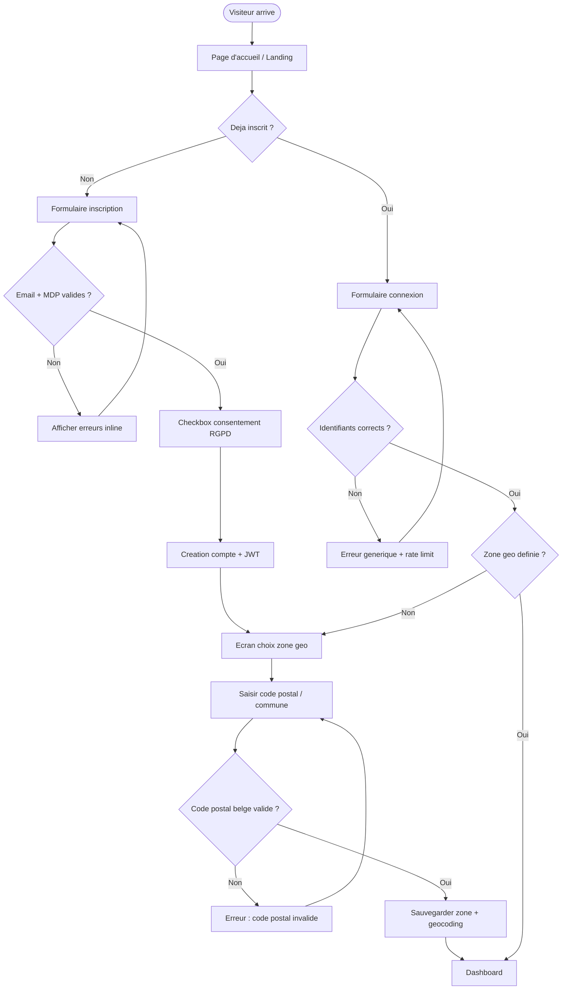
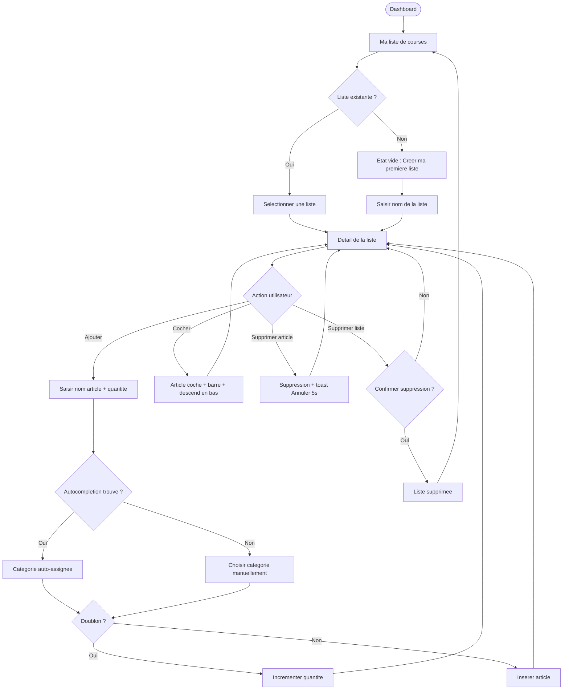
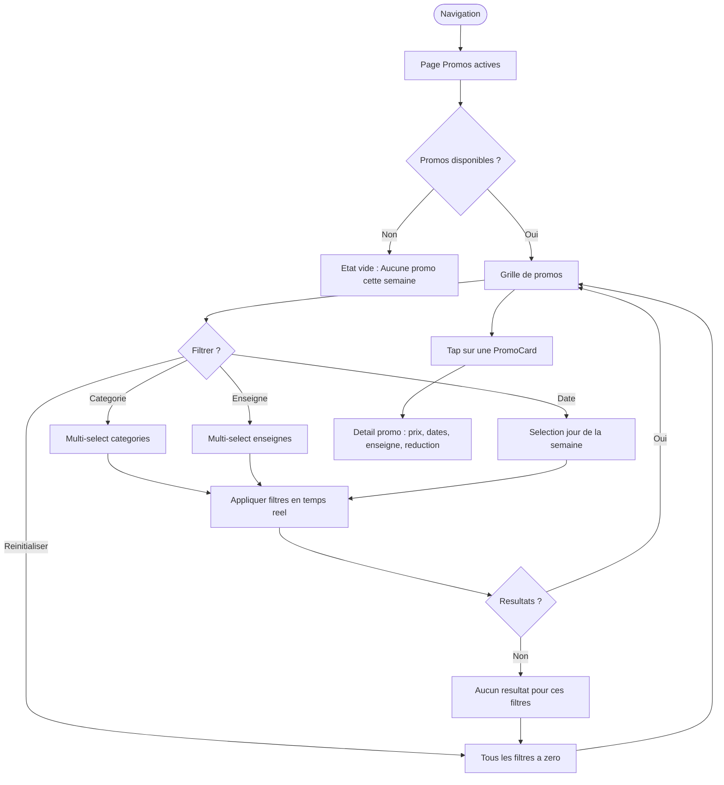
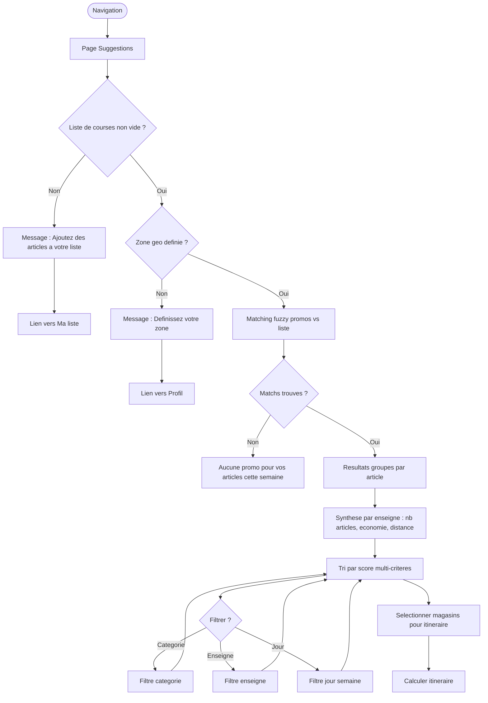
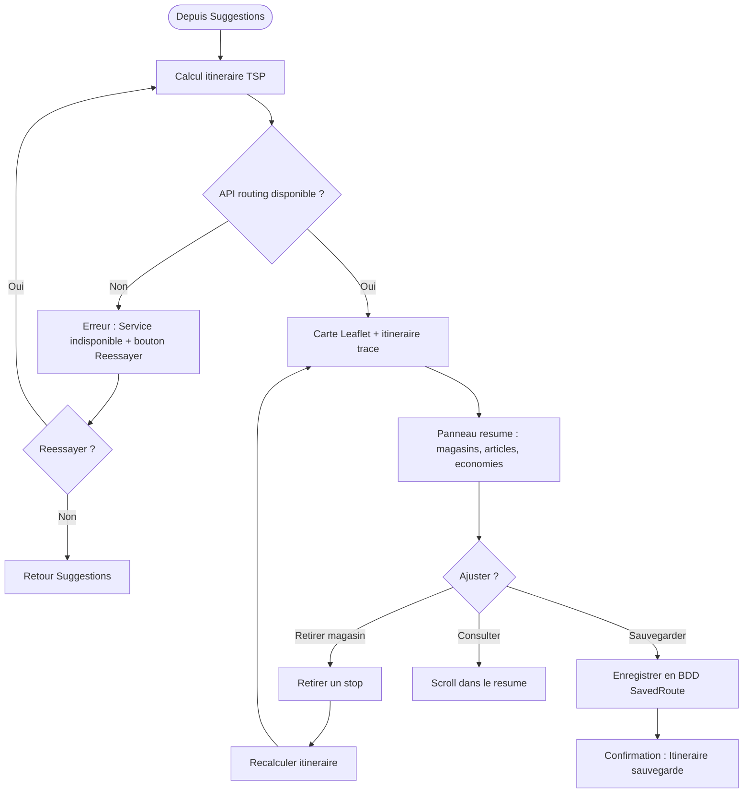

# UI/UX Design — PromoScan (MVP)
> Agent #3 — UI/UX Designer
> Date : 2026-06-05
> Source : FONDATION-PROMOSCAN.md + stories.md

---

## A. User Flows

### Flow 1 — Inscription / Connexion / Zone geo



### Flow 2 — Gestion liste de courses



### Flow 3 — Consultation promos



### Flow 4 — Suggestions ou/quand



### Flow 5 — Itineraire



---

## B. Wireframes textuels

### Ecran 1 — Page d'accueil / Landing (non connecte)

```
┌─────────────────────────────────────────────┐
│  [Logo PromoScan]          [Connexion] [CTA] │
├─────────────────────────────────────────────┤
│                                             │
│         ┌───────────────────────┐           │
│         │   Hero Section        │           │
│         │                       │           │
│         │   "Vos courses,       │           │
│         │    moins cheres,      │           │
│         │    plus malin."       │           │
│         │                       │           │
│         │   Sous-titre :        │           │
│         │   PromoScan analyse   │           │
│         │   les promos de 6     │           │
│         │   enseignes belges    │           │
│         │   et optimise votre   │           │
│         │   itineraire.         │           │
│         │                       │           │
│         │  [████ S'inscrire ████]│  ← CTA   │
│         │   Deja membre ?       │           │
│         │   Se connecter        │           │
│         └───────────────────────┘           │
│                                             │
│  ┌──────────┐ ┌──────────┐ ┌──────────┐    │
│  │ Icon 1   │ │ Icon 2   │ │ Icon 3   │    │
│  │ Promos   │ │ Liste    │ │ Carte    │    │
│  │ auto     │ │ perso    │ │ optimis. │    │
│  │ 6 ens.   │ │ courses  │ │ trajet   │    │
│  └──────────┘ └──────────┘ └──────────┘    │
│                                             │
│  ┌─────────────────────────────────────┐    │
│  │ Section "Comment ca marche ?"       │    │
│  │  1. Creez votre liste               │    │
│  │  2. On trouve les promos            │    │
│  │  3. Suivez l'itineraire             │    │
│  └─────────────────────────────────────┘    │
│                                             │
│  ┌─────────────────────────────────────┐    │
│  │ Logos enseignes :                   │    │
│  │ Colruyt Delhaize Lidl Aldi          │    │
│  │ Carrefour Action                    │    │
│  └─────────────────────────────────────┘    │
│                                             │
├─────────────────────────────────────────────┤
│  Footer : A propos · CGU · Contact          │
└─────────────────────────────────────────────┘
```

**Mobile (375px) :** Hero plein ecran, 3 features en colonne, logos enseignes en grille 3x2.

---

### Ecran 2 — Dashboard (connecte)

```
┌─────────────────────────────────────────────┐
│  [Logo]  Bonjour, [prenom]     [⚙ Profil]  │
├─────────────────────────────────────────────┤
│                                             │
│  ┌─ Bandeau zone ─────────────────────┐     │
│  │ 📍 1000 Bruxelles         [Modifier]│     │
│  └────────────────────────────────────┘     │
│                                             │
│  ┌─ Promos du moment ────────────────┐      │
│  │ "12 promos correspondent a        │      │
│  │  votre liste cette semaine"       │      │
│  │                                   │      │
│  │ ┌──────────┐ ┌──────────┐        │      │
│  │ │PromoCard │ │PromoCard │  →     │      │
│  │ │ Poulet   │ │ Lait     │ scroll │      │
│  │ │ -30%     │ │ -25%     │        │      │
│  │ │ Colruyt  │ │ Delhaize │        │      │
│  │ └──────────┘ └──────────┘        │      │
│  │                                   │      │
│  │ [Voir toutes les suggestions →]   │      │
│  └───────────────────────────────────┘      │
│                                             │
│  ┌─ Liste active ────────────────────┐      │
│  │ "Semaine" — 8 articles            │      │
│  │  ☐ Poulet (2)                     │      │
│  │  ☐ Lait (1)                       │      │
│  │  ☐ Tomates (3)                    │      │
│  │  ☑ Pain (1) ~~barre~~            │      │
│  │                                   │      │
│  │ [Ouvrir la liste →]               │      │
│  └───────────────────────────────────┘      │
│                                             │
│  ┌─ Economies estimees ─────────────┐       │
│  │  💰 ~14.30 EUR cette semaine      │       │
│  │  3 enseignes avec des promos      │       │
│  │  [Voir l'itineraire →]    ← CTA  │       │
│  └───────────────────────────────────┘       │
│                                             │
├─────────────────────────────────────────────┤
│ [🏠 Home] [📋 Liste] [🔥 Promos] [🗺 Carte]│
└─────────────────────────────────────────────┘
```

**CTA principal :** "Voir l'itineraire" — acces direct au calcul de route.
**Mobile :** Bottom nav 4 onglets. Les 3 sections en scroll vertical.

---

### Ecran 3 — Ma liste de courses

```
┌─────────────────────────────────────────────┐
│  [← Retour]   Ma liste de courses   [+ Nouvelle]│
├─────────────────────────────────────────────┤
│                                             │
│  ┌─ Selecteur de liste ─────────────┐       │
│  │ [v Semaine ▾]  8 articles        │       │
│  │                  [⋮ Options]      │       │
│  └──────────────────────────────────┘       │
│                                             │
│  ┌─ Ajouter un article ────────────┐        │
│  │ [🔍 Rechercher un produit...   ] │        │
│  │ Quantite : [1] [+] [-]          │        │
│  │ [████ Ajouter ████]              │        │
│  └──────────────────────────────────┘        │
│                                             │
│  ── Proteines ──────────────────────         │
│  │ ☐ Poulet              x2    [🗑] │        │
│  │ ☐ Saumon              x1    [🗑] │        │
│                                             │
│  ── Legumes ────────────────────────         │
│  │ ☐ Tomates             x3    [🗑] │        │
│  │ ☐ Courgettes          x2    [🗑] │        │
│                                             │
│  ── Produits laitiers ──────────────         │
│  │ ☐ Lait                x1    [🗑] │        │
│  │ ☐ Beurre              x1    [🗑] │        │
│                                             │
│  ── Boulangerie ────────────────────         │
│  │ ☑ Pain  ~~barre~~     x1    [🗑] │        │
│                                             │
│  ── Epicerie ───────────────────────         │
│  │ ☐ Pates               x2    [🗑] │        │
│                                             │
│  ┌──────────────────────────────────┐        │
│  │ [Decocher tout]                  │        │
│  │ [Voir les suggestions pour       │        │
│  │  cette liste →]          ← CTA   │        │
│  └──────────────────────────────────┘        │
│                                             │
├─────────────────────────────────────────────┤
│ [🏠 Home] [📋 Liste] [🔥 Promos] [🗺 Carte]│
└─────────────────────────────────────────────┘
```

**Interactions :**
- Swipe gauche sur un article = suppression + toast "Annuler" 5s
- Tap checkbox = article coche, descend sous les non-coches
- Barre de recherche avec autocompletion apres 2 caracteres
- Articles groupes par categorie avec separateurs visuels (Gestalt : proximite)

---

### Ecran 4 — Promos actives

```
┌─────────────────────────────────────────────┐
│  [← Retour]     Promos actives      [Filtres]│
├─────────────────────────────────────────────┤
│                                             │
│  ┌─ Filtres (panneau repliable) ────┐       │
│  │ Categorie : [Toutes ▾]          │       │
│  │ Enseigne  : [Toutes ▾]          │       │
│  │ Jour      : [Cette semaine ▾]   │       │
│  │ [Reinitialiser]                  │       │
│  └──────────────────────────────────┘       │
│                                             │
│  Resultats : 47 promos                      │
│                                             │
│  ┌──────────┐ ┌──────────┐                  │
│  │ PromoCard│ │ PromoCard│                  │
│  │┌────────┐│ │┌────────┐│                  │
│  ││ [img]  ││ ││ [img]  ││                  │
│  │└────────┘│ │└────────┘│                  │
│  │ Poulet   │ │ Lait     │                  │
│  │ entier   │ │ demi-ecr.│                  │
│  │          │ │          │                  │
│  │ 8.99 →   │ │ 1.89 →   │                  │
│  │ 5.99     │ │ 1.29     │                  │
│  │ -33%     │ │ -32%     │                  │
│  │          │ │          │                  │
│  │ [Colruyt]│ │[Delhaize]│                  │
│  │ Jusq.12/6│ │ Jusq.11/6│                  │
│  └──────────┘ └──────────┘                  │
│                                             │
│  ┌──────────┐ ┌──────────┐                  │
│  │ PromoCard│ │ PromoCard│                  │
│  │ ...      │ │ ...      │                  │
│  └──────────┘ └──────────┘                  │
│                                             │
│  [Charger plus...]                          │
│                                             │
├─────────────────────────────────────────────┤
│ [🏠 Home] [📋 Liste] [🔥 Promos] [🗺 Carte]│
└─────────────────────────────────────────────┘
```

**Layout :** Grille 2 colonnes mobile, 3 colonnes tablette, 4 colonnes desktop.
**Filtres :** Panneau repliable en mobile pour economiser l'espace (Hick-Hyman : pas trop d'options visibles a la fois). Sticky en desktop (sidebar gauche).

---

### Ecran 5 — Suggestions

```
┌─────────────────────────────────────────────┐
│  [← Retour]     Suggestions         [Filtres]│
├─────────────────────────────────────────────┤
│                                             │
│  ┌─ Resume ────────────────────────┐        │
│  │ 8 articles dans votre liste     │        │
│  │ 12 promos trouvees              │        │
│  │ Economie max estimee : 14.30 EUR│        │
│  └─────────────────────────────────┘        │
│                                             │
│  ┌─ Par enseigne (tri par score) ──┐        │
│  │                                 │        │
│  │ ┌─────────────────────────────┐ │        │
│  │ │ 🟢 Colruyt         Score 87 │ │        │
│  │ │ 5 articles en promo         │ │        │
│  │ │ Economie : 8.40 EUR         │ │        │
│  │ │ Distance : 1.2 km           │ │        │
│  │ │ [Voir les promos ▾]         │ │        │
│  │ │  - Poulet : 8.99→5.99 (-33%)│ │        │
│  │ │  - Tomates : 2.49→1.49 (-40)│ │        │
│  │ │  - ...                      │ │        │
│  │ │ [☐ Ajouter a l'itineraire]  │ │        │
│  │ └─────────────────────────────┘ │        │
│  │                                 │        │
│  │ ┌─────────────────────────────┐ │        │
│  │ │ 🟡 Delhaize       Score 62  │ │        │
│  │ │ 3 articles en promo         │ │        │
│  │ │ Economie : 4.20 EUR         │ │        │
│  │ │ Distance : 2.8 km           │ │        │
│  │ │ [Voir les promos ▾]         │ │        │
│  │ │ [☐ Ajouter a l'itineraire]  │ │        │
│  │ └─────────────────────────────┘ │        │
│  │                                 │        │
│  │ ┌─────────────────────────────┐ │        │
│  │ │ 🔴 Lidl            Score 41 │ │        │
│  │ │ 1 article en promo          │ │        │
│  │ │ ...                         │ │        │
│  │ └─────────────────────────────┘ │        │
│  └─────────────────────────────────┘        │
│                                             │
│  ┌──────────────────────────────────┐       │
│  │ 2 magasins selectionnes          │       │
│  │ [████ Calculer l'itineraire ████] ← CTA  │
│  └──────────────────────────────────┘       │
│                                             │
├─────────────────────────────────────────────┤
│ [🏠 Home] [📋 Liste] [🔥 Promos] [🗺 Carte]│
└─────────────────────────────────────────────┘
```

**Score visuel :** Pastille couleur (vert > 70, jaune 40-70, rouge < 40). Le score est calcule cote backend (US-018) et affiche de facon simple.
**CTA :** "Calculer l'itineraire" — fixe en bas de page (Fitts : position previsible et accessible au pouce).
**Accordeons :** Les promos par enseigne sont en accordeon repliable (Miller : limiter l'info visible).

---

### Ecran 6 — Carte / Itineraire

```
┌─────────────────────────────────────────────┐
│  [← Retour]    Mon itineraire       [💾 Save]│
├─────────────────────────────────────────────┤
│                                             │
│  ┌─────────────────────────────────────┐    │
│  │                                     │    │
│  │        ┌──────────────────┐         │    │
│  │        │                  │         │    │
│  │     🏠 │    CARTE LEAFLET │         │    │
│  │   start│                  │         │    │
│  │        │   1. [Colruyt]   │         │    │
│  │        │        │         │         │    │
│  │        │   2. [Delhaize]  │         │    │
│  │        │        │         │         │    │
│  │     🏠 │    (retour)      │         │    │
│  │   end  │                  │         │    │
│  │        └──────────────────┘         │    │
│  │                                     │    │
│  │  [+] [-] zoom   [📍 Recentrer]     │    │
│  └─────────────────────────────────────┘    │
│                                             │
│  ┌─ Resume itineraire (panneau) ─────┐      │
│  │ Distance totale : 8.4 km          │      │
│  │ Temps estime : 22 min             │      │
│  │ Economie totale : 12.60 EUR       │      │
│  │                                   │      │
│  │ ── Stop 1 : Colruyt ──────────    │      │
│  │ │ Poulet x2         -33% (3.00)│  │      │
│  │ │ Tomates x3        -40% (3.00)│  │      │
│  │ │ Pates x2          -20% (0.60)│  │      │
│  │ │ Sous-total eco : 6.60 EUR    │  │      │
│  │ │ Trajet : 4 min               │  │      │
│  │ │ [✕ Retirer ce stop]          │  │      │
│  │                                   │      │
│  │ ── Stop 2 : Delhaize ─────────    │      │
│  │ │ Lait x1           -32% (0.60)│  │      │
│  │ │ Beurre x1         -25% (0.50)│  │      │
│  │ │ Saumon x1         -30% (4.90)│  │      │
│  │ │ Sous-total eco : 6.00 EUR    │  │      │
│  │ │ Trajet : 7 min               │  │      │
│  │ │ [✕ Retirer ce stop]          │  │      │
│  │                                   │      │
│  │ ── Retour domicile ───────────    │      │
│  │ │ Trajet : 11 min              │  │      │
│  └───────────────────────────────────┘      │
│                                             │
├─────────────────────────────────────────────┤
│ [🏠 Home] [📋 Liste] [🔥 Promos] [🗺 Carte]│
└─────────────────────────────────────────────┘
```

**Desktop (1440px) :** Layout split 62% carte / 38% panneau resume (ratio phi).
**Mobile (375px) :** Carte en haut (60vh), panneau resume en dessous, scrollable. La carte peut etre reduite via un drag handle.
**Interactions carte :** Marqueurs cliquables (popup avec nom enseigne + articles). Polyligne coloree pour le trajet.

---

### Ecran 7 — Profil / Settings

```
┌─────────────────────────────────────────────┐
│  [← Retour]       Mon profil        [📝 Edit]│
├─────────────────────────────────────────────┤
│                                             │
│  ┌─ Zone geographique ──────────────┐       │
│  │ Code postal : [1000    ]         │       │
│  │ Commune : Bruxelles              │       │
│  │ [Modifier]                       │       │
│  └──────────────────────────────────┘       │
│                                             │
│  ┌─ Preferences ────────────────────┐       │
│  │ Priorite :                       │       │
│  │ Budget ○───────●───○ Distance    │       │
│  │ (slider 3 positions)             │       │
│  │                                  │       │
│  │ Enseignes favorites :            │       │
│  │ ☑ Colruyt  ☑ Delhaize            │       │
│  │ ☑ Lidl     ☐ Aldi               │       │
│  │ ☐ Carrefour ☐ Action            │       │
│  └──────────────────────────────────┘       │
│                                             │
│  ┌─ Compte ─────────────────────────┐       │
│  │ Email : e***@gmail.com           │       │
│  │ [Changer l'email]                │       │
│  │ [Changer le mot de passe]        │       │
│  └──────────────────────────────────┘       │
│                                             │
│  ┌─ Itineraires sauvegardes ────────┐       │
│  │ 3 itineraires                    │       │
│  │ 02/06 — 3 magasins — 14.30 EUR  │       │
│  │ 28/05 — 2 magasins — 8.20 EUR   │       │
│  │ 21/05 — 4 magasins — 22.10 EUR  │       │
│  │ [Voir tout →]                    │       │
│  └──────────────────────────────────┘       │
│                                             │
│  ┌─ Danger zone ────────────────────┐       │
│  │ [🗑 Supprimer mon compte]        │       │
│  │ Toutes vos donnees seront        │       │
│  │ definitivement supprimees.       │       │
│  └──────────────────────────────────┘       │
│                                             │
├─────────────────────────────────────────────┤
│ [🏠 Home] [📋 Liste] [🔥 Promos] [🗺 Carte]│
└─────────────────────────────────────────────┘
```

---

### Ecran 8 — Etats vides (4 variantes)

**8a. Liste vide (US-016)**
```
┌─────────────────────────────────────────────┐
│           Ma liste de courses               │
├─────────────────────────────────────────────┤
│                                             │
│              ┌──────────┐                   │
│              │  📋 (illu)│                   │
│              └──────────┘                   │
│                                             │
│     Votre liste est vide.                   │
│     Ajoutez vos premiers articles           │
│     pour recevoir des suggestions           │
│     de promos !                             │
│                                             │
│     [████ Ajouter un article ████]  ← CTA   │
│                                             │
│     ---- ou ----                            │
│                                             │
│     Vous n'avez aucune liste ?              │
│     [Creer ma premiere liste]               │
│                                             │
└─────────────────────────────────────────────┘
```

**8b. Aucune promo (US-020)**
```
┌─────────────────────────────────────────────┐
│            Promos actives                   │
├─────────────────────────────────────────────┤
│                                             │
│              ┌──────────┐                   │
│              │  🔥 (illu)│                   │
│              └──────────┘                   │
│                                             │
│     Aucune promotion trouvee pour           │
│     vos articles cette semaine.             │
│                                             │
│     Revenez bientot, les folders sont       │
│     mis a jour chaque semaine !             │
│                                             │
│     [Modifier ma liste →]                   │
│                                             │
└─────────────────────────────────────────────┘
```

**8c. Aucun match suggestions (US-020)**
```
┌─────────────────────────────────────────────┐
│             Suggestions                     │
├─────────────────────────────────────────────┤
│                                             │
│              ┌──────────┐                   │
│              │  🔍 (illu)│                   │
│              └──────────┘                   │
│                                             │
│     Aucun magasin trouve pres de            │
│     1000 Bruxelles.                         │
│                                             │
│     Verifiez votre code postal              │
│     ou elargissez votre zone.               │
│                                             │
│     [Modifier ma zone →]                    │
│                                             │
└─────────────────────────────────────────────┘
```

**8d. Erreur itineraire (US-025)**
```
┌─────────────────────────────────────────────┐
│            Mon itineraire                   │
├─────────────────────────────────────────────┤
│                                             │
│              ┌──────────┐                   │
│              │  ⚠ (illu) │                   │
│              └──────────┘                   │
│                                             │
│     Service de calcul d'itineraire          │
│     temporairement indisponible.            │
│                                             │
│     [████ Reessayer ████]           ← CTA   │
│                                             │
│     [← Retour aux suggestions]              │
│                                             │
└─────────────────────────────────────────────┘
```

---

## C. Composants reutilisables (Atomic Design)

### Atoms

| Composant | Props principales | Variantes |
|-----------|------------------|-----------|
| **Button** | `label`, `onClick`, `variant`, `size`, `disabled`, `loading`, `icon?` | `primary` / `secondary` / `ghost` / `danger` ; `sm` / `md` / `lg` |
| **Input** | `value`, `onChange`, `placeholder`, `type`, `error?`, `label?` | `text` / `search` / `password` / `number` |
| **Checkbox** | `checked`, `onChange`, `label?`, `disabled?` | default / checked / indeterminate |
| **Badge** | `label`, `variant` | `discount` (orange) / `category` (gris) / `score` (vert/jaune/rouge) |
| **Tag** | `label`, `onRemove?`, `variant` | `store` / `category` / `day` |
| **Icon** | `name`, `size`, `color`, `aria-label` | Tailles : `16` / `20` / `24` |
| **Avatar** | `initials`, `size` | `sm` (32px) / `md` (40px) / `lg` (48px) |
| **Spinner** | `size` | `sm` / `md` / `lg` |
| **Toast** | `message`, `action?`, `duration` | `success` / `error` / `info` / `undo` |
| **Divider** | `label?` | horizontal / avec label (separateur de categorie) |

### Molecules

| Composant | Props principales | Description |
|-----------|------------------|-------------|
| **PromoCard** | `productName`, `originalPrice`, `promoPrice`, `discountPct`, `storeBrand`, `endDate`, `imageUrl?` | Carte affichant une promotion individuelle. Prix barre + prix promo + badge reduction. |
| **ProductItem** | `name`, `quantity`, `category`, `checked`, `onCheck`, `onDelete`, `onQuantityChange` | Ligne d'article dans une liste de courses. Checkbox + nom + quantite + icone supprimer. |
| **StoreChip** | `name`, `brand`, `distance?`, `selected?`, `onClick` | Chip cliquable representant une enseigne. Logo + nom + distance optionnelle. |
| **SearchBar** | `value`, `onChange`, `suggestions[]`, `onSelect`, `placeholder` | Barre de recherche avec dropdown d'autocompletion. |
| **FilterGroup** | `label`, `options[]`, `selectedValues[]`, `onChange`, `type` | Groupe de filtres : multi-select dropdown ou chips selectionnables. |
| **ScoreIndicator** | `score`, `maxScore?` | Pastille coloree (vert/jaune/rouge) + valeur numerique du score. |
| **PriceDisplay** | `originalPrice`, `promoPrice`, `discountPct` | Affichage prix : ancien prix barre + nouveau prix + badge pourcentage. |
| **EmptyState** | `icon`, `title`, `description`, `ctaLabel?`, `ctaAction?` | Ecran vide reutilisable : illustration + message + CTA optionnel. |
| **StoreRow** | `store`, `matchCount`, `estimatedSavings`, `distance`, `score`, `expanded`, `promos[]` | Ligne de synthese par enseigne dans les suggestions. Accordeon expandable. |
| **RouteStopCard** | `store`, `items[]`, `savings`, `travelTime`, `onRemove` | Carte d'un stop dans le resume d'itineraire. |

### Organisms

| Composant | Props principales | Description |
|-----------|------------------|-------------|
| **Navbar** | `user?`, `currentRoute` | Navigation principale. Desktop : header horizontal. Mobile : bottom tab bar 4 onglets. |
| **BottomNav** | `activeTab`, `tabs[]` | Barre de navigation mobile (4 onglets : Home, Liste, Promos, Carte). Min 44px par tab (Fitts). |
| **PromoGrid** | `promos[]`, `loading`, `onLoadMore`, `hasMore` | Grille responsive de PromoCards avec chargement infini. 2 col mobile, 3 tab, 4 desktop. |
| **ShoppingList** | `list`, `items[]`, `onCheck`, `onDelete`, `onAdd`, `onQuantityChange` | Liste de courses complete : barre d'ajout + items groupes par categorie + actions. |
| **SuggestionPanel** | `suggestions[]`, `onSelectStore`, `selectedStores[]` | Panneau de suggestions avec StoreRows triees par score. Filtres integres. |
| **MapView** | `center`, `markers[]`, `route?`, `onMarkerClick` | Carte Leaflet avec marqueurs enseignes + polyligne itineraire + controles zoom. |
| **RouteSummary** | `stops[]`, `totalDistance`, `totalTime`, `totalSavings`, `onRemoveStop`, `onSave` | Resume textuel de l'itineraire : stops ordonnes + economies + bouton sauvegarder. |
| **FilterBar** | `filters`, `activeFilters`, `onChange`, `onReset` | Barre de filtres combinables (categorie + enseigne + jour). Desktop : sidebar. Mobile : panneau repliable. |
| **HeroSection** | `title`, `subtitle`, `ctaLabel`, `ctaAction` | Section hero de la landing page. |
| **ProfileSection** | `title`, `children` | Section generique du profil avec titre + contenu. |

### Templates

| Template | Description | Utilise par |
|----------|-------------|-------------|
| **AppLayout** | Layout principal : Navbar (top desktop / bottom mobile) + zone contenu + padding responsive. | Tous les ecrans connectes |
| **DashboardLayout** | Layout dashboard : bandeau zone + 3 sections empilees (promos, liste, economies). | Dashboard |
| **ListLayout** | Layout liste : selecteur de liste + barre d'ajout + liste d'items groupes. | Ma liste de courses |
| **PromoLayout** | Layout promos : filtres (sidebar desktop / panneau mobile) + grille de cartes. | Promos actives |
| **MapLayout** | Layout carte : carte (62%) + panneau resume (38%) desktop. Carte + panneau empile mobile. | Carte / Itineraire |
| **AuthLayout** | Layout auth : centrage vertical + formulaire + fond illustre. | Inscription / Connexion |
| **EmptyLayout** | Layout etats vides : centrage vertical + illustration + message + CTA. | 4 etats vides |

---

## D. Design Tokens

### Couleurs

```css
:root {
  /* --- Primary (vert — economies, action positive) --- */
  --color-primary-50: #f0fdf4;
  --color-primary-100: #dcfce7;
  --color-primary-200: #bbf7d0;
  --color-primary-300: #86efac;
  --color-primary-400: #4ade80;
  --color-primary-500: #22c55e;   /* CTA principal, economies */
  --color-primary-600: #16a34a;
  --color-primary-700: #15803d;
  --color-primary-800: #166534;
  --color-primary-900: #14532d;

  /* --- Secondary (orange — promos, promotions, urgence douce) --- */
  --color-secondary-50: #fff7ed;
  --color-secondary-100: #ffedd5;
  --color-secondary-200: #fed7aa;
  --color-secondary-300: #fdba74;
  --color-secondary-400: #fb923c;
  --color-secondary-500: #f97316;   /* Badges promo, reductions */
  --color-secondary-600: #ea580c;
  --color-secondary-700: #c2410c;
  --color-secondary-800: #9a3412;
  --color-secondary-900: #7c2d12;

  /* --- Accent (bleu — navigation, carte, liens) --- */
  --color-accent-50: #eff6ff;
  --color-accent-100: #dbeafe;
  --color-accent-200: #bfdbfe;
  --color-accent-300: #93c5fd;
  --color-accent-400: #60a5fa;
  --color-accent-500: #3b82f6;   /* Liens, carte, itineraire */
  --color-accent-600: #2563eb;
  --color-accent-700: #1d4ed8;
  --color-accent-800: #1e40af;
  --color-accent-900: #1e3a8a;

  /* --- Success --- */
  --color-success-500: #22c55e;
  --color-success-100: #dcfce7;

  /* --- Warning --- */
  --color-warning-500: #eab308;
  --color-warning-100: #fef9c3;

  /* --- Error --- */
  --color-error-500: #ef4444;
  --color-error-100: #fee2e2;
  --color-error-600: #dc2626;

  /* --- Neutral --- */
  --color-neutral-0: #ffffff;
  --color-neutral-50: #f9fafb;
  --color-neutral-100: #f3f4f6;
  --color-neutral-200: #e5e7eb;
  --color-neutral-300: #d1d5db;
  --color-neutral-400: #9ca3af;
  --color-neutral-500: #6b7280;
  --color-neutral-600: #4b5563;
  --color-neutral-700: #374151;
  --color-neutral-800: #1f2937;
  --color-neutral-900: #111827;
}

/* --- Dark mode (prevu, pas MVP) --- */
[data-theme="dark"] {
  --color-neutral-0: #111827;
  --color-neutral-50: #1f2937;
  --color-neutral-100: #374151;
  --color-neutral-200: #4b5563;
  --color-neutral-300: #6b7280;
  --color-neutral-400: #9ca3af;
  --color-neutral-500: #d1d5db;
  --color-neutral-600: #e5e7eb;
  --color-neutral-700: #f3f4f6;
  --color-neutral-800: #f9fafb;
  --color-neutral-900: #ffffff;
}
```

### Typographie

```css
:root {
  /* Font family */
  --font-sans: 'Inter', system-ui, -apple-system, sans-serif;
  --font-mono: 'JetBrains Mono', 'Fira Code', monospace;

  /* Font sizes (mobile-first, rem) */
  --text-xs: 0.75rem;     /* 12px */
  --text-sm: 0.875rem;    /* 14px */
  --text-base: 1rem;      /* 16px */
  --text-lg: 1.125rem;    /* 18px */
  --text-xl: 1.25rem;     /* 20px */
  --text-2xl: 1.5rem;     /* 24px */
  --text-3xl: 1.875rem;   /* 30px */

  /* Line heights */
  --leading-tight: 1.25;
  --leading-normal: 1.5;
  --leading-relaxed: 1.75;

  /* Font weights */
  --font-normal: 400;
  --font-medium: 500;
  --font-semibold: 600;
  --font-bold: 700;
}
```

### Espacements (grille 8px)

```css
:root {
  --space-0: 0;
  --space-1: 0.25rem;   /*  4px — micro-espacement */
  --space-2: 0.5rem;    /*  8px */
  --space-3: 0.75rem;   /* 12px */
  --space-4: 1rem;      /* 16px */
  --space-6: 1.5rem;    /* 24px */
  --space-8: 2rem;      /* 32px */
  --space-12: 3rem;     /* 48px */
  --space-16: 4rem;     /* 64px */
}
```

### Bordures

```css
:root {
  /* Border radius */
  --radius-sm: 0.25rem;   /*  4px */
  --radius-md: 0.5rem;    /*  8px */
  --radius-lg: 0.75rem;   /* 12px */
  --radius-xl: 1rem;      /* 16px */
  --radius-full: 9999px;  /* pilule / cercle */

  /* Border widths */
  --border-thin: 1px;
  --border-medium: 2px;
  --border-thick: 3px;
}
```

### Ombres

```css
:root {
  --shadow-sm: 0 1px 2px 0 rgba(0, 0, 0, 0.05);
  --shadow-md: 0 4px 6px -1px rgba(0, 0, 0, 0.1), 0 2px 4px -2px rgba(0, 0, 0, 0.1);
  --shadow-lg: 0 10px 15px -3px rgba(0, 0, 0, 0.1), 0 4px 6px -4px rgba(0, 0, 0, 0.1);
}
```

### Breakpoints

```css
/* Mobile-first : styles par defaut = 375px */
/* sm (tablette) : @media (min-width: 768px) */
/* lg (desktop)  : @media (min-width: 1440px) */

:root {
  --breakpoint-sm: 768px;
  --breakpoint-lg: 1440px;
}
```

### Animations

```css
:root {
  --duration-fast: 150ms;
  --duration-normal: 250ms;
  --duration-slow: 400ms;

  --easing-default: cubic-bezier(0.4, 0, 0.2, 1);
  --easing-in: cubic-bezier(0.4, 0, 1, 1);
  --easing-out: cubic-bezier(0, 0, 0.2, 1);
}
```

### Mapping Tailwind recommande

```js
// tailwind.config.ts — extrait
{
  theme: {
    extend: {
      colors: {
        primary: { /* --color-primary-* */ },
        secondary: { /* --color-secondary-* */ },
        accent: { /* --color-accent-* */ },
      },
      fontFamily: {
        sans: ['Inter', 'system-ui', 'sans-serif'],
      },
      screens: {
        sm: '768px',
        lg: '1440px',
      },
    },
  },
}
```

---

## E. Navigation et layout

### Structure de navigation

**Mobile (375px - 767px) — Bottom Tab Bar :**
```
[🏠 Home]  [📋 Liste]  [🔥 Promos]  [🗺 Carte]
```
- 4 onglets, hauteur 56px (>44px pour Fitts tactile)
- Onglet actif : icone remplie + label colore (primary-500)
- Onglet inactif : icone outline + label gris (neutral-400)

**Desktop (768px+) — Sidebar gauche :**
```
┌─────────┐
│ [Logo]  │
│         │
│ 🏠 Home │
│ 📋 Liste│
│ 🔥 Promos│
│ 🗺 Carte│
│         │
│ ─────── │
│ ⚙ Profil│
│ 🚪 Deco │
└─────────┘
```
- Sidebar fixe, largeur 240px (repliable a 64px icones seules)
- Profil et deconnexion en bas de la sidebar
- Zone de contenu prend le reste de la largeur

### Routing

| URL | Page | Auth requise | Description |
|-----|------|-------------|-------------|
| `/` | Landing | Non | Page d'accueil marketing |
| `/login` | Connexion | Non | Formulaire login |
| `/register` | Inscription | Non | Formulaire inscription + RGPD |
| `/dashboard` | Dashboard | Oui | Vue d'ensemble connectee |
| `/lists` | Mes listes | Oui | Liste de toutes les listes de courses |
| `/lists/:id` | Detail liste | Oui | CRUD articles d'une liste |
| `/promos` | Promos actives | Oui | Grille de promotions avec filtres |
| `/promos/:id` | Detail promo | Oui | Detail d'une promotion |
| `/suggestions` | Suggestions | Oui | Matching promos vs liste |
| `/route` | Itineraire | Oui | Carte + resume itineraire |
| `/profile` | Profil | Oui | Settings utilisateur |
| `/profile/routes` | Itineraires sauvegardes | Oui | Historique des routes |

### Hierarchie visuelle — CTA principal par ecran

| Ecran | CTA principal | Style |
|-------|--------------|-------|
| Landing | "S'inscrire gratuitement" | Button primary lg |
| Dashboard | "Voir l'itineraire" | Button primary md |
| Ma liste | "Voir les suggestions" | Button primary md |
| Promos actives | (pas de CTA unique — navigation par cartes) | — |
| Suggestions | "Calculer l'itineraire" | Button primary lg, fixe en bas |
| Carte/Itineraire | "Sauvegarder" | Button primary md, header |
| Profil | (pas de CTA unique — formulaire) | — |
| Etats vides | Action corrective contextuelle | Button primary md, centre |

---

## F. Accessibilite

### Contraste WCAG AA

| Element | Ratio minimum | Implementation |
|---------|--------------|----------------|
| Texte normal (< 18px) | 4.5:1 | neutral-700 sur neutral-0 = 8.6:1 (ok) |
| Texte large (>= 18px bold ou >= 24px) | 3:1 | neutral-600 sur neutral-0 = 5.9:1 (ok) |
| Composants UI (bordures, icones) | 3:1 | neutral-400 sur neutral-0 = 3.9:1 (ok) |
| Texte sur primary-500 | 4.5:1 | neutral-0 (blanc) sur primary-500 = 4.6:1 (ok) |
| Texte sur secondary-500 | 4.5:1 | neutral-900 sur secondary-500 = 5.2:1 (ok) |

### Focus visible

```css
/* Focus ring global */
*:focus-visible {
  outline: 2px solid var(--color-accent-500);
  outline-offset: 2px;
  border-radius: var(--radius-sm);
}

/* Suppression du outline natif uniquement si focus-visible est supporte */
*:focus:not(:focus-visible) {
  outline: none;
}
```

- Tous les elements interactifs (Button, Input, Checkbox, Tab, Link, Card cliquable) recoivent un focus ring visible
- L'ordre de tabulation suit l'ordre visuel de lecture (pas de `tabindex` positif)
- Les modales et menus trap le focus a l'interieur

### HTML semantique

| Element UI | Balise HTML |
|-----------|-------------|
| Navigation | `<nav aria-label="Navigation principale">` |
| Sections dashboard | `<section aria-labelledby="section-title">` |
| Liste de courses | `<ul role="list">` + `<li>` |
| PromoCard | `<article>` |
| Formulaire | `<form>` + `<label for>` + `<fieldset>` |
| Filtres | `<fieldset>` + `<legend>` |
| Toast | `<div role="alert" aria-live="polite">` |
| Erreur formulaire | `<span role="alert" id="error-*">` + `aria-describedby` |
| Spinner | `<div role="status" aria-label="Chargement">` |

### Labels aria pour icones seules

```tsx
// Bouton icone sans texte visible
<button aria-label="Supprimer l'article Poulet">
  <TrashIcon aria-hidden="true" />
</button>

// Icone decorative dans un label textuel
<span>
  <MapPinIcon aria-hidden="true" />
  1000 Bruxelles
</span>

// Badge de reduction
<span aria-label="Reduction de 33 pourcent">
  <Badge>-33%</Badge>
</span>
```

### Regles supplementaires

- **Pas de `color-only` pour transmettre de l'information.** Les scores (vert/jaune/rouge) ont aussi une valeur numerique affichee.
- **Tailles de cible tactile** : min 44x44px pour tous les elements interactifs (Fitts).
- **Animations** : respect de `prefers-reduced-motion`. Les animations sont desactivees pour les utilisateurs qui le demandent.

```css
@media (prefers-reduced-motion: reduce) {
  * {
    animation-duration: 0.01ms !important;
    transition-duration: 0.01ms !important;
  }
}
```

- **Langue** : `<html lang="fr">` pour le marche belge francophone.
- **Skip link** : un lien "Aller au contenu principal" en premiere position du DOM, visible uniquement au focus.

---

## Annexe — Decisions de design

| Decision | Justification | Loi/Heuristique |
|----------|--------------|-----------------|
| Bottom nav 4 onglets mobile | Max 5 onglets (Hick-Hyman). 4 onglets = acces direct aux 4 fonctions core. | Hick-Hyman, Jakob |
| Filtres en panneau repliable mobile | Eviter de surcharger l'ecran mobile. L'utilisateur ouvre les filtres quand il en a besoin. | Tesler, Nielsen #8 |
| Articles groupes par categorie avec separateurs | Permet de scanner visuellement la liste. Groupes de 4-5 items max. | Gestalt (proximite), Miller |
| Score couleur + valeur numerique | Pas de color-only. Accessibilite + comprehension rapide. | WCAG, Nielsen #1 |
| Toast "Annuler" 5s apres suppression | Filet de securite pour les suppressions accidentelles. | Nielsen #3 (annulation), #5 (prevention erreurs) |
| CTA fixe en bas sur Suggestions | Position previsible, accessible au pouce. Action principale toujours visible. | Fitts, Nielsen #6 |
| Layout carte 62/38 desktop | Ratio dore (phi). Carte dominante, resume en complement. | Composition phi |
| Grille 8px sans exception | Coherence visuelle, alignement automatique, espacement predictible. | Grille 8px, Gestalt (continuite) |
| Autocompletion apres 2 caracteres | Equilibre entre performance et utilite. Trop tot = bruit, trop tard = inutile. | Nielsen #7 (flexibilite) |
| Palette vert/orange/bleu | Vert = economies (positif). Orange = promos (attention). Bleu = navigation/carte (neutre informatif). | Semantique couleur, domaine alimentaire |
