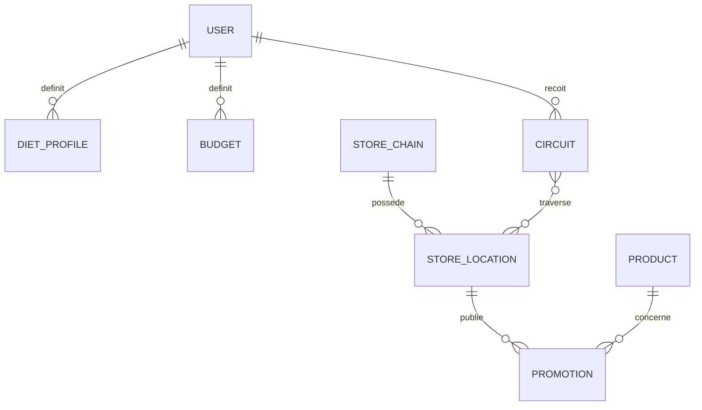
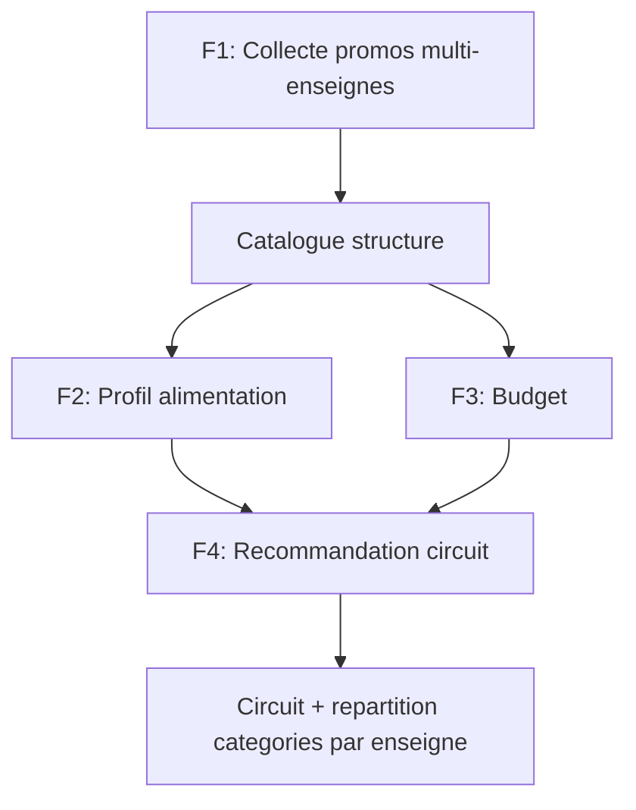

# Cahier des Charges — PromoScan
> mentalyas · Full-Stack Dev
> Date : 2026-08-08
> Statut : Brainstorm niveau 1 (v2 — remplace l'ancienne fondation à un seul niveau, archivée dans `docs/_archive-v1/`)
> Niveaux exécutés : `docs/brainstorm/L1-fondation.md`

---

## 1. Concept Global

PromoScan est un assistant qui scanne automatiquement les promotions de plusieurs enseignes alimentaires belges (actuellement diffusées sous forme de folders papier ou PDF/HTML, fastidieux à consulter et comparer manuellement) et transforme cette information brute en une solution de courses prête à l'emploi. À partir d'un profil alimentaire (général ou basé sur des recettes précises) et d'un budget, l'app calcule le meilleur circuit de magasins à faire dans une région donnée, en répartissant les catégories de produits (fruits/légumes, protéines, etc.) sur les enseignes les plus intéressantes selon leurs promos du moment. Le MVP est utilisé en solo par mentalyas pour valider l'usage réel ; l'objectif à terme est un déploiement grand public destiné aux familles.

## 2. Fonctionnalités

### Fonctionnalités core (MVP) — ordre de développement volontaire
L'ordre ci-dessous n'est pas arbitraire : la fonctionnalité 1 (collecte) conditionne la faisabilité et la conception de toutes les suivantes. Construire les fonctionnalités 2-4 avant de savoir ce qui est réellement extractible serait un risque de travail jeté.

- [ ] **F1 — Collecte & structuration des promotions** (à développer en premier, risque technique le plus élevé). Scan multi-enseignes belges (Colruyt, Delhaize, Aldi, Lidl, etc. — repris de la v1), quel que soit le format source (page HTML, PDF, image), extraction et normalisation en catalogue structuré (produit, prix, prix promo, enseigne, période de validité, catégorie).
- [ ] **F2 — Profil alimentation** : définir un type d'alimentation général, ou une liste de recettes précises à préparer.
- [ ] **F3 — Budget** : définir une enveloppe budgétaire pour la période de courses.
- [ ] **F4 — Recommandation de circuit de magasins** : sur base de F1+F2+F3 et d'une région choisie, proposer le meilleur circuit/combo de magasins, avec répartition des catégories de produits (fruits/légumes, protéines, etc.) selon les enseignes les plus avantageuses.

### Fonctionnalités secondaires (v2+)
- [ ] **F5 — Habitudes alimentaires permanentes** : verrouiller un profil récurrent (type d'alimentation + budget habituels).
- [ ] **F6 — Notifications proactives** : alerter quand une offre intéressante correspond au profil verrouillé.
- [ ] **F7 — Suggestion du meilleur jour de la semaine** pour faire les courses, en fonction des promos actives.
- [ ] Auth sociale, multi-profils par foyer (un compte = plusieurs membres de famille) — évoqué comme piste, non retenu tant que le F1-F4 solo n'est pas validé.

### Hors scope (explicitement exclu pour le MVP)
- Paiement / abonnement in-app
- Application mobile native (le MVP est PWA — Progressive Web App)
- Extension géographique hors Belgique
- Comparateur produit-par-code-barres façon PingPrice (hors périmètre — PromoScan planifie un circuit, ne compare pas un scan ponctuel)

## 3. Structure de Base de Données (provisoire)

> Le schéma ci-dessous est une hypothèse de travail. Les entités liées aux promotions/produits (Promotion, Product) seront affinées une fois le spike F1 réalisé et les formats réels de données connus — voir alerte en section 12.

### Entités principales
| Entité | Champs clés | Relations |
|--------|-------------|-----------|
| User | id, email, password_hash (Supabase Auth) | 1-N DietProfile, 1-N ShoppingList |
| StoreChain | id, nom (Colruyt, Delhaize, Aldi, Lidl...) | 1-N StoreLocation |
| StoreLocation | id, storeChainId, adresse, lat/lng | 1-N Promotion |
| Promotion *(provisoire)* | id, storeLocationId, produit, prix, prix_promo, categorie, date_debut, date_fin, source_format (html/pdf/image) | N-1 StoreLocation |
| Product *(provisoire)* | id, nom, categorie, alias[] | 1-N Promotion (via matching) |
| DietProfile | id, userId, type (général/recettes), recettes[] | N-1 User |
| Budget | id, userId, montant, periode | N-1 User |
| Circuit | id, userId, region, magasins[], repartitionCategories | N-1 User |

### Diagramme ERD (Mermaid)

## 4. Diagrammes Use Cases — Vue d'ensemble (Mermaid)

## 5. Stack Technologique Recommandée

| Couche | Technologie | Justification |
|--------|-------------|----------------|
| Framework full-stack | Next.js (App Router) | Un seul projet (frontend + API via Route Handlers/Server Actions), déploiement natif Vercel — remplace le split `src/api`+`src/web` de la v1. |
| Hébergement | Vercel (projet unique) | Compte existant, gratuit pour ce volume. Supprime la dépendance à Render (mise en veille du free tier après inactivité, problème connu de la v1). |
| Scraping/extraction planifiée | Vercel Cron Jobs | Remplace n8n pour la production (décision explicite : pas de service séparé à héberger 24/7). n8n reste utilisable en local (Docker Desktop) pour prototyper la logique d'extraction avant de la porter en fonction Vercel. |
| Base de données | Supabase Postgres (intégration Marketplace Vercel) | Compte existant. Fournit aussi Auth et Storage sur la même plateforme. |
| Authentification | Supabase Auth | Remplace le JWT + refresh token custom de la v1 — moins de code, moins de surface de bug sécurité. |
| ORM | Prisma | Repris de la v1, mature et documenté. |
| Extraction IA (PDF/image non structurés) | Claude API (Vision) | Repris de la v1 pour les folders non-HTML. |
| Notifications (v2) | Web Push (service worker, VAPID) | Gratuit, cohérent avec le choix PWA. |
| Géocodage / itinéraire | Nominatim (OSM) + Haversine SQL | Repris de la v1, suffisant pour 2-6 arrêts. |
| Frontend UI | React + TypeScript strict + Tailwind + Zustand + TanStack Query + React Hook Form + Zod | Conforme au standard global. |
| PWA | manifest.json + service worker (`next-pwa` ou config manuelle) | Installable mobile, notifications push, sans app store. |

## 6. Algorithmes & Patterns Techniques
- **Extraction multi-format** — pipeline à 3 branches selon la source (HTML : scraping structuré ; PDF/image : Claude Vision + prompt d'extraction) convergeant vers un schéma de promotion unique. À concevoir précisément lors du spike F1.
- **Matching produit ↔ recette/liste de courses** — fuzzy matching (ex. Fuse.js) ou recherche full-text Postgres (`pg_trgm`), à trancher selon le volume/qualité réel des données collectées.
- **Allocation catégorie → enseigne** — pour chaque catégorie de produit (fruits/légumes, protéines...), sélectionner l'enseigne avec le meilleur ratio promo/besoin, sous contrainte du budget global (proche d'un problème d'allocation sous contrainte, type knapsack simplifié).
- **Optimisation de circuit** — heuristique nearest-neighbor (repris de la v1) pour ordonner les arrêts, suffisant pour 2-6 magasins.

## 7. Sécurité — Bloc Dédié

### Niveau de sensibilité des données
Faible à moyen. Compte utilisateur (email/mot de passe via Supabase Auth), localisation approximative (région), habitudes alimentaires. Pas de paiement, pas de donnée de santé, pas de donnée bancaire en MVP. Relève du RGPD (Règlement Général sur la Protection des Données) standard.

### Vulnérabilités à anticiper
| Risque | Vecteur | Mitigation |
|--------|---------|------------|
| Injection SQL | Requêtes sur catalogue produits/promotions | Prisma (requêtes paramétrées), jamais de concaténation |
| XSS | Contenu de promotions scrapé affiché en front | Sanitization stricte du contenu scrapé avant stockage/affichage |
| Auth faible | Comptes utilisateurs | Supabase Auth (hash géré nativement, pas de custom) |
| Abus de scraping | Cron jobs trop agressifs sur les sites enseignes | Rate limiting / User-Agent identifié / respect robots.txt, cache agressif |
| Fuite de données géo | Localisation utilisateur | Stocker une région/code postal, pas de coordonnées GPS précises tant que non nécessaire |

### Exceptions & Gestion d'erreurs
- Ne jamais exposer les stack traces en production.
- Messages d'erreur génériques pour l'utilisateur final.
- Logging structuré côté serveur (sans données sensibles).
- Le scraping doit tolérer la panne partielle : une enseigne indisponible ne bloque pas la collecte des autres (repris de la v1).

### Checklist sécurité minimale
- [ ] Authentification sécurisée via Supabase Auth (pas de hash custom)
- [ ] HTTPS obligatoire (natif Vercel)
- [ ] Variables d'env pour tous les secrets (Supabase keys, Claude API key)
- [ ] Rate limiting sur les endpoints sensibles et sur les crons de scraping
- [ ] Validation des entrées côté serveur (Zod)

## 8. Références

| Référence | Ce qui est inspirant | Ce qu'on fait différemment |
|-----------|----------------------|------------------------------|
| [PromoPromo](https://www.promopromo.be/fr/categories/supermarche) | Agrégateur belge de folders promo par enseigne, filtrable par localisation — concurrent direct le plus proche en Belgique | S'arrête à l'affichage des folders : pas de profil alimentation, pas de budget, pas de circuit ni de répartition par magasin |
| [PingPrice / G4U](https://www.retaildetail.be/fr/news/food/lapplication-belge-g4u-apporte-une-transparence-radicale-des-prix-dans-les-supermarches/) | Comparaison de prix produit par produit entre enseignes belges | Logique de scan ponctuel produit par produit, pas de planification de courses ni d'itinéraire ; G4U est payant (abonnement) |
| [Test-Achats — calculateur supermarché le moins cher](https://www.test-achats.be/famille-prive/supermarches/calculateur/le-supermarche-le-moins-cher-de-votre-quartier) | Calcul du supermarché le moins cher pour un panier donné dans sa région | Un seul magasin recommandé, pas de circuit multi-enseignes ni de répartition par catégorie |
| [Flipp](https://apps.apple.com/) (US/Canada) | Référence internationale : agrège les folders hebdomadaires de centaines d'enseignes, recherche produit → prix le plus bas à proximité | Pas de planification de circuit multi-arrêts ni de profil alimentation/recette |
| [Grocery Routes / CartSage](https://www.groceryroutes.com/grocery-price-comparison-app/) | Calcule des circuits à 1, 2 ou 3 magasins à partir d'une liste de courses complète, groupés par arrêt — le concept le plus proche de F4 | Ne part pas d'un profil alimentaire/recettes ni d'un budget contraint ; marché nord-américain, pas de source belge |

## 9-11. (non applicable — niveau 1 seul pour l'instant)

## 12. Résumé exécutif & Statut

### Résumé exécutif
Les folders promo (papier ou digitaux) restent un format brut que personne ne compare sérieusement entre enseignes chaque semaine. PromoScan digère cette information et la transforme directement en circuit de courses actionnable, adapté au profil alimentaire et au budget de l'utilisateur. MVP solo (mentalyas) pour valider l'usage réel avant un déploiement grand public visant les familles en Belgique.

### Points ouverts / décisions restantes
- [ ] Format réel des promotions par enseigne (HTML/PDF/image) — à déterminer par le spike F1, conditionne le schéma `Promotion`/`Product` définitif.
- [ ] Choix définitif matching produit (Fuse.js vs `pg_trgm` Postgres) — dépendant du volume/qualité de données récupérées via F1.
- [ ] Granularité de la localisation utilisateur (région vs code postal vs GPS) à trancher lors du design F4.

### Prochaines étapes
1. Lancer le niveau 2 du brainstorm (détail par fonctionnalité) — en commençant par **F1 (collecte & structuration)**, qui présente les signaux forts (intégration/scraping de sources tierces multiples, formats hétérogènes) justifiant un niveau 3 (conception technique) dédié.
2. Une fois F1 conçu, enchaîner F2, F3, F4 en boucle niveau 2, avec niveau 3 si signal fort détecté (ex. F4 : algorithme d'allocation sous contrainte).
