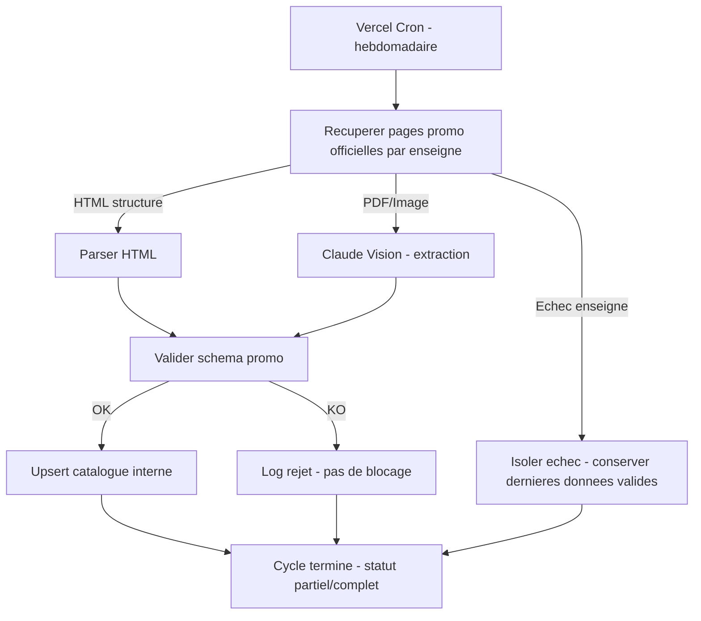

# Niveau 2 — Détail Fonctionnalité : F1 — Collecte & structuration des promotions
> Projet : PromoScan · Basé sur : docs/brainstorm/L1-fondation.md
> Date : 2026-08-08

## 1. Objectif de la fonctionnalité

Récupérer automatiquement, de façon planifiée, les promotions alimentaires directement sur les sites officiels des enseignes belges couvertes (Colruyt, Delhaize, Aldi, Lidl, à étendre ensuite), et les transformer en un catalogue interne structuré et exploitable (produit, prix, prix promo, catégorie, enseigne, période de validité). C'est le socle technique de tout le reste de l'app — sans données fiables ici, aucune recommandation de circuit n'est possible.

> **Pivot de stratégie (2026-08-08)** : PromoPromo.be avait été envisagé comme source primaire unique (un seul format à gérer). Vérification faite : ses pages "catégories"/"magasins" ne sont que des répertoires de couvertures de brochures scannées, et les données produit individuelles vivent derrière des URLs `?offer=` explicitement interdites par son `robots.txt`. L'agrégation n'apporte donc pas la simplification espérée (il aurait fallu de toute façon de l'OCR/Claude Vision sur chaque brochure, avec en plus une contrainte légale sur les liens détaillés). **Décision : scraper directement les sites des enseignes.** PromoPromo.be reste une référence concurrentielle (section 8 du L1) mais n'est plus une source de données.

## 2. Use Cases précis

### UC-1 : Déclenchement planifié de la collecte
- **Acteur :** Système (Vercel Cron Job)
- **Déclencheur :** Planning hebdomadaire (jour à définir selon le rythme réel de publication des promos par enseigne — probablement mercredi, à confirmer par enseigne lors du spike)
- **Scénario nominal :**
  1. Le cron déclenche la fonction de collecte
  2. La fonction itère sur la liste des enseignes configurées (Colruyt, Delhaize, Aldi, Lidl)
  3. Pour chaque enseigne, la ou les pages promo/catalogue officielles sont récupérées, dans le respect du `crawl-delay` propre à chaque site (ex. 5s chez Colruyt)
- **Scénarios alternatifs / erreurs :**
  - Le cron échoue à démarrer (timeout plateforme) → nouvelle tentative au prochain déclenchement, alerte loguée
- **Post-condition :** Liste des pages à traiter constituée

### UC-2 : Extraction structurée d'une page de promotions
- **Acteur :** Système
- **Déclencheur :** Page listing récupérée avec succès (UC-1)
- **Scénario nominal :**
  1. Le contenu HTML de la page est parsé
  2. Les informations de chaque promo (produit, prix normal, prix promo, dates de validité, enseigne, catégorie si disponible) sont extraites
  3. Les données extraites sont validées (champs obligatoires présents, prix cohérents)
  4. Les données validées sont écrites dans le catalogue interne (upsert par produit+enseigne+période)
- **Scénarios alternatifs / erreurs :**
  - La page n'est pas au format HTML attendu (PDF ou image intégrée) → bascule vers l'extraction Claude Vision (UC-3)
  - Une donnée obligatoire manque (ex. pas de prix) → l'entrée est rejetée et loguée, ne bloque pas les autres
  - La structure de la page a changé depuis la dernière collecte (0 promo extraite alors qu'il y en avait la semaine précédente) → alerte spécifique "dérive de format", ne pas écraser silencieusement le catalogue existant
- **Post-condition :** Promotions de la page ajoutées/mises à jour dans le catalogue interne

### UC-3 : Extraction via IA (fallback PDF/image)
- **Acteur :** Système
- **Déclencheur :** UC-2 détecte un contenu non-HTML structuré (PDF ou image)
- **Scénario nominal :**
  1. Le document est envoyé à Claude Vision avec un prompt d'extraction structurée
  2. La réponse (JSON attendu) est validée contre le schéma de promotion
  3. Les données validées suivent le même chemin que UC-2 (étape 4)
- **Scénarios alternatifs / erreurs :**
  - Réponse Claude non conforme au schéma attendu → rejet loggé, pas d'insertion de données invalides
  - Timeout ou erreur API Claude → retry avec backoff, puis abandon de cette page pour ce cycle (pas de blocage global)
- **Post-condition :** Promotions extraites du document non-structuré, mêmes garanties que UC-2

### UC-5 : Interface de contrôle de la collecte
- **Acteur :** mentalyas (utilisateur authentifié)
- **Déclencheur :** Besoin de vérifier visuellement ce qui a été collecté, sans interroger la base directement
- **Scénario nominal :**
  1. L'utilisateur accède à une page protégée par son compte (Supabase Auth, même mécanisme que le reste de l'app)
  2. Il consulte la liste des promotions collectées, filtrable par enseigne et par catégorie
  3. Il consulte l'historique des `CollectionRun` (date, statut, nombre d'items par enseigne) pour repérer un échec ou une dérive de format
  4. Il peut déclencher une collecte manuelle à la demande (sans attendre le cron hebdomadaire), utile en phase de développement/debug
- **Scénarios alternatifs / erreurs :**
  - Une collecte manuelle est déclenchée alors qu'un run est déjà en cours → réutilise la même garde anti-concurrence que UC-1 (409, message clair côté UI)
- **Post-condition :** L'utilisateur a une vue fiable de l'état du catalogue sans avoir besoin d'un accès direct à la base

### UC-4 : Tolérance de panne partielle
- **Acteur :** Système
- **Déclencheur :** Une enseigne/page échoue systématiquement (site down, blocage, format cassé)
- **Scénario nominal :**
  1. L'échec est isolé à cette enseigne/page uniquement
  2. Les autres enseignes continuent d'être traitées normalement dans le même cycle
  3. Le catalogue conserve les dernières données valides connues pour l'enseigne en échec (pas de suppression)
- **Post-condition :** Cycle de collecte terminé avec un statut partiel documenté (ex. "5/6 enseignes collectées")

## 3. Workflow (Mermaid)

## 4. Règles métier
| # | Règle | Justification |
|---|-------|----------------|
| 1 | Respecter le `robots.txt` de chaque enseigne (voir table ci-dessous, vérifiée le 2026-08-08) — ne jamais crawler un chemin/paramètre explicitement disallow | Obligation légale minimale, risque de blocage IP si ignoré |
| 2 | Respecter le `crawl-delay` propre à chaque site quand il est spécifié (ex. 5s chez Colruyt) | Évite la surcharge du site source et le risque de blocage |
| 3 | Une enseigne/page en échec ne bloque jamais la collecte des autres | Résilience — repris de la v1 |
| 4 | Ne jamais écraser le catalogue existant avec un résultat vide/suspect (0 promo extraite alors que la semaine précédente il y en avait) | Détecte une dérive de format silencieuse plutôt que de vider le catalogue par erreur |
| 5 | PromoPromo.be n'est plus une source de données (pivot ci-dessus) — conservé uniquement comme référence concurrentielle | Ses données produit sont derrière des URLs interdites par son `robots.txt`, et ses brochures sont scannées (pas de gain vs enseignes directes) |

### Contraintes `robots.txt` par enseigne (vérifié le 2026-08-08)
| Enseigne | Chemins/paramètres interdits pertinents | Crawl-delay | Risque pour le scraping promo |
|----------|------------------------------------------|-------------|-------------------------------|
| Colruyt | `/content/clp` (mais `*.json` sous ce chemin autorisé) | 5s | Faible — à confirmer que les pages promo visées ne sont pas sous `/content/clp` en HTML pur |
| Delhaize | `*/search/*`, `*/search?*`, `*/customerhub/quick-shop/*` | Non spécifié | Faible si les pages promo ne passent pas par la recherche/quick-shop |
| Aldi | `/mds/`, `/*?*filters`, `/*?*jobId=` | Non spécifié | Faible à moyen — vérifier si le catalogue promo utilise des filtres en query param |
| Lidl | `*search?q=*`, `*?offset=*`, `*sort=*`, `*id=*`, `*pageId=*`, `*advisor=*` | Non spécifié | **Moyen à élevé** — plusieurs patterns dynamiques bloqués (`id=`, `pageId=`) pourraient couvrir les pages de détail promo ; à vérifier précisément lors du spike avant de coder le parser Lidl |

Ce tableau est une base de départ pour le niveau 3 (contrat technique) — chaque URL réelle utilisée par le scraper devra être confrontée à ces règles avant implémentation, pas seulement au moment du spike.

### Faisabilité technique par enseigne — vérifiée en conditions réelles (2026-08-08)

> Vérification faite avec un vrai navigateur (rendu JS complet), pas un simple fetch HTTP — plusieurs enseignes sont des SPA dont le contenu n'existe pas dans le HTML brut initial.

| Enseigne | Page vérifiée | Constat | Approche technique retenue |
|----------|----------------|---------|------------------------------|
| **Colruyt** | `colruyt.be/fr/actions` | SPA (rien en HTML brut). Mais API JSON interne documentée publiquement par la communauté (`ecgproductmw.colruyt.be/ecgproductmw/v2/nl/products/`), nécessite une clé `X-CG-APIKEY` récupérable au chargement de page. | Client HTTP direct vers l'API interne — pas de navigateur nécessaire en production, le plus léger des 4 |
| **Aldi** | `aldi.be/fr/offres.html` | HTML server-rendered classique, structure semi-statique | Scraping HTML direct (fetch + parseur type Cheerio) |
| **Delhaize** | `delhaize.be/fr/promotions` | Données riches et bien structurées confirmées (nom, format, prix, prix promo, catégorie — 1062 produits, regroupés par catégorie alimentaire exactement comme souhaité). Chargées via un endpoint interne `delhaize.be/api/v1/...` (composant `CmsProductList`), pas présentes dans le HTML brut initial | Rendu navigateur headless (Playwright) pour capturer l'appel, **ou** reverse engineering direct de `/api/v1/` à finaliser en niveau 3 |
| **Lidl** | `lidl.be/c/fr-BE/promotions-cette-semaine/a10082242` | Contrairement à l'hypothèse initiale (basée sur une limite technique de l'outil de vérification, pas une vraie restriction du site) : données très riches confirmées (nom, prix barré, %, prix promo, prix/kg, dates de validité, origine). Chargement via appels internes sur `lidl.be` lui-même (pas de blocage CORS observé). L'URL utilisée (`/c/fr-BE/.../a10082242`) ne correspond à aucun des patterns interdits par le `robots.txt` (`id=`, `pageId=` sont des query params, pas des segments de chemin) | Rendu navigateur headless (Playwright), même famille de solution que Delhaize |

**Conclusion : les 4 enseignes sont faisables pour le MVP.** Colruyt et Aldi sont les plus simples (pas de navigateur headless nécessaire). Delhaize et Lidl demandent un rendu JS (Playwright ou équivalent) — technique plus lourde mais standard, à héberger dans la fonction Vercel Cron (Playwright fonctionne sur Vercel Functions via un package compatible serverless, ex. `@sparticuz/chromium`).

## 5. Critères d'acceptation (Definition of Done)
- [x] Le `robots.txt` de Colruyt/Delhaize/Aldi/Lidl est vérifié (voir table ci-dessus) — Lidl confirmé non-bloqué sur l'URL promo réelle utilisée
- [x] Faisabilité technique des 4 enseignes vérifiée en conditions réelles (navigateur) — voir table de faisabilité ci-dessus
- [ ] Au moins une enseigne est collectée de bout en bout avec des données correctes vérifiées manuellement (Colruyt ou Aldi en premier — les plus simples)
- [ ] Au moins une enseigne nécessitant le rendu headless (Delhaize ou Lidl) est collectée de bout en bout
- [ ] Au moins un cas PDF/image est traité via le fallback Claude Vision et produit un résultat structuré valide
- [ ] Une panne simulée sur une enseigne n'empêche pas la collecte des autres
- [ ] Une dérive de format (0 résultat inattendu) déclenche une alerte et ne vide pas le catalogue existant
- [ ] Le catalogue interne contient au minimum : produit, prix normal, prix promo, enseigne, catégorie, dates de validité
- [ ] Une interface protégée (Supabase Auth) permet de lister les promotions collectées (filtrable enseigne/catégorie), de consulter l'historique des runs de collecte, et de déclencher une collecte manuelle

## 6. Signal de complexité — Niveau 3 nécessaire ?
| Critère | Présent ? | Détail |
|---------|-----------|--------|
| Logique métier complexe (calculs, machine à états) | Oui | Pipeline ETL multi-branches (HTML vs Vision), gestion d'état par cycle de collecte (partiel/complet), détection de dérive de format |
| Intégration API tierce | Oui | Scraping PromoPromo.be (site tiers, dépendance externe) + Claude Vision API |
| Données sensibles (paiement/santé/légal) | Non — mais **risque légal réel** (conformité scraping, `robots.txt`) à traiter comme un signal fort équivalent | Voir règle 1 |
| Accès multi-rôles / permissions différenciées | Non | — |

**Recommandation :** Niveau 3 nécessaire sur F1 — le contrat exact de scraping (sélecteurs HTML, format de requête à PromoPromo.be, structure précise du prompt Claude Vision, schéma de données définitif, stratégie de retry/backoff, config du Vercel Cron) doit être conçu en détail avant implémentation, et le point légal (règle 1) doit être résolu en premier.
