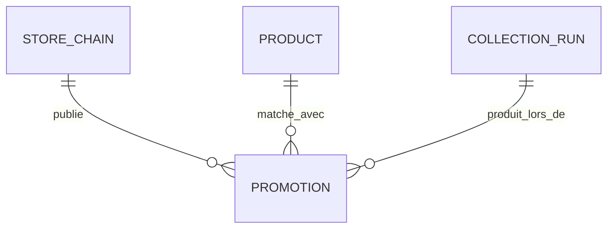
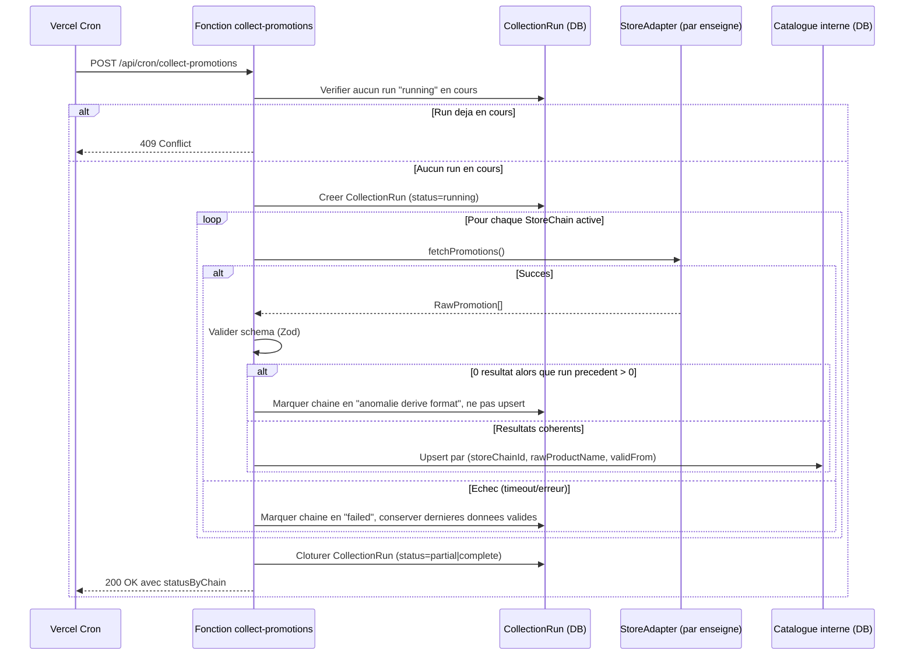

# Niveau 3 — Conception Technique : F1 — Collecte & structuration des promotions
> Basé sur : docs/brainstorm/L1-fondation.md + docs/brainstorm/L2-f1-collecte-promotions.md
> Date : 2026-08-08

## 1. Contrat API

### Endpoint déclencheur (interne, jamais exposé publiquement)
| Endpoint | Méthode | Entrée | Sortie | Codes d'erreur |
|----------|---------|--------|--------|-----------------|
| `/api/cron/collect-promotions` | POST | Header `Authorization: Bearer <CRON_SECRET>` (secret Vercel Cron natif) | `{ success, data: { runId, statusByChain: [{chain, status, itemsCollected}] } }` | 401 (secret invalide), 409 (une collecte est déjà en cours), 500 (erreur non anticipée) |

### Interface de contrôle (page protégée Supabase Auth — `/dashboard/collecte`)
| Endpoint | Méthode | Entrée | Sortie | Codes d'erreur |
|----------|---------|--------|--------|-----------------|
| `/api/promotions` | GET | Query params optionnels `storeChain`, `category`, pagination (`page`, `limit`) | `{ success, data: { items: Promotion[], total, page } }` | 401 (non authentifié) |
| `/api/collection-runs` | GET | Pagination (`page`, `limit`) | `{ success, data: { items: CollectionRun[], total } }` | 401 |
| `/api/collections/trigger` | POST | Session utilisateur valide (cookie Supabase) | Même corps de réponse que `/api/cron/collect-promotions` | 401, 409 (run déjà en cours) |

La logique métier de collecte est partagée entre `/api/cron/collect-promotions` (auth par `CRON_SECRET`) et `/api/collections/trigger` (auth par session utilisateur) — un seul service interne, deux points d'entrée avec des mécanismes d'authentification différents.

### Contrat interne — interface commune à tous les adaptateurs enseigne
Chaque enseigne implémente la même interface, quelle que soit sa stratégie technique (API / HTML / headless) — l'orchestrateur ne connaît jamais le détail d'implémentation :

```ts
interface StoreAdapter {
  chainSlug: string; // "colruyt" | "aldi" | "delhaize" | "lidl"
  strategy: "api" | "html" | "headless";
  fetchPromotions(): Promise<RawPromotion[]>; // leve une erreur specifique par etape (fetch/parse/validate)
}

interface RawPromotion {
  rawProductName: string;
  category: string | null;
  unitLabel: string | null;       // ex: "750 gr", "1 kg", "en vrac"
  regularPrice: number | null;
  promoPrice: number;
  discountPercent: number | null;
  pricePerUnit: number | null;    // ex: 2.79 €/kg
  validFrom: string;              // ISO date
  validTo: string;                // ISO date
  sourceUrl: string;
  originLabel: string | null;     // ex: "Belgique" (vu chez Lidl)
}
```

## 2. Schéma de données détaillé

> Périmètre F1 : le catalogue de promotions est rattaché à l'**enseigne** (StoreChain), pas à un magasin physique précis — les pages collectées sont des catalogues nationaux/chaîne, pas des pages par point de vente. Les adresses de magasins physiques (nécessaires pour F4 — calcul de circuit) seront une source séparée, hors périmètre F1.

### Tables/Collections concernées
| Table | Colonnes | Contraintes | Index |
|-------|----------|-------------|-------|
| `StoreChain` | id, slug, name, strategy (`api`\|`html`\|`headless`), baseUrl, isActive | slug unique | — |
| `Product` | id, canonicalName, category, aliases (string[]) | — | GIN sur aliases (ou `pg_trgm` si recherche floue) |
| `Promotion` | id, storeChainId (FK), productId (FK nullable — matching différé), rawProductName, category, unitLabel, regularPrice, promoPrice, discountPercent, pricePerUnit, validFrom, validTo, sourceUrl, collectedAt | **unique(storeChainId, rawProductName, validFrom)** — clé d'idempotence | (storeChainId, validFrom), (productId) |
| `CollectionRun` | id, startedAt, finishedAt, status (`running`\|`partial`\|`complete`\|`failed`), resultsByChain (JSON: `[{chainSlug, status, itemsCollected, error}]`) | — | (startedAt desc) |

### Diagramme ERD (delta vs L1)


## 3. Diagramme de séquence (Mermaid)


## 4. Cas limites techniques

- **Concurrence :** le run vérifie qu'aucun `CollectionRun` n'est en statut `running` avant de démarrer (garde en base, pas juste en mémoire — la fonction peut s'exécuter sur une instance différente à chaque invocation). Si un run précédent est bloqué en `running` depuis plus d'un délai raisonnable (ex. 2x la durée max attendue), il est considéré comme échoué et un nouveau run peut démarrer.
- **Idempotence :** la contrainte unique `(storeChainId, rawProductName, validFrom)` garantit qu'un rejeu de la même collecte fait un upsert (mise à jour) plutôt qu'une duplication.
- **Transactions / rollback :** l'upsert des promotions d'une enseigne se fait dans une transaction unique par enseigne (tout ou rien pour cette enseigne). Pas de transaction globale inter-enseignes — cohérent avec la règle de résilience (une enseigne en échec n'affecte pas les autres).
- **Volumétrie :** Delhaize a montré ~1062 produits en promotion sur une seule catégorie de page. Le scraping doit gérer la pagination de l'API/page source (paramètres `limit`/`offset` ou équivalent par enseigne). Le temps d'exécution total risque de dépasser les capacités d'une seule invocation de fonction pour les enseignes en rendu headless (Delhaize, Lidl) — prévoir soit un cron par enseigne (4 crons distincts plutôt qu'un seul orchestrateur séquentiel), soit un découpage par catégorie en plusieurs invocations. À trancher précisément lors de l'implémentation selon les temps mesurés réellement.

## 5. Sécurité spécifique à cette fonctionnalité

| Risque | Vecteur | Mitigation |
|--------|---------|------------|
| Déclenchement abusif de la collecte | Endpoint `/api/cron/collect-promotions` appelé depuis l'extérieur | Vérification du secret `CRON_SECRET` (mécanisme natif Vercel Cron), rejet 401 sinon |
| Clé API Colruyt invalide/expirée | La clé `X-CG-APIKEY` est extraite dynamiquement d'une page publique Colruyt, pas une vraie clé secrète — elle peut changer sans préavis | Ne jamais la coder en dur : extraction à la volée à chaque run, ou variable d'env revue périodiquement. Échec de récupération = enseigne marquée en échec (résilience), pas de blocage global |
| Exécution de navigateur headless en environnement serverless | Delhaize/Lidl nécessitent Playwright + Chromium dans une fonction Vercel | Utiliser un package conçu pour serverless (`@sparticuz/chromium`), timeout explicite par enseigne, jamais de code arbitraire exécuté dans la page (pas d'injection de scripts non contrôlés) |
| Fuite d'information via les logs de collecte | Erreurs de scraping loguées | Ne jamais logger le contenu brut des pages scrapées (peut contenir des données de session/tracking tiers) — logguer uniquement statut, nombre d'items, code d'erreur |
| Blocage IP par une enseigne (rate limit / anti-bot) | Fréquence de collecte trop agressive | Respect strict du `crawl-delay` par enseigne (règle L2 #2), User-Agent identifiable, un seul run hebdomadaire par défaut |
